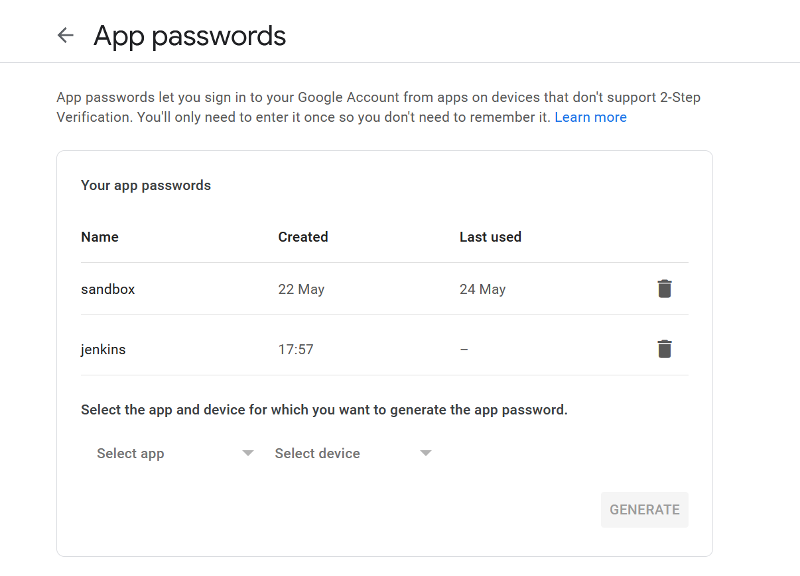

# Objectif Pédagogique
Cette formation sur Jenkins vise à doter les participants des compétences nécessaires pour installer, configurer et gérer des pipelines CI/CD avec Jenkins. L'approche de cette formation inclut l'intégration d'outils clés tels que Jenkins, Docker et Kubernetes, formant ainsi une chaîne complète d'intégration et de déploiement continus.

Cette formation s'adresse principalement aux ingénieurs DevOps en formation ainsi qu'à toute personne souhaitant acquérir une compréhension approfondie de la mise en place de pipelines CI/CD avec Jenkins.

## Compétences Acquises
À l'issue de cette formation, les participants seront capables de :

Installer et configurer Jenkins : Maîtriser les étapes nécessaires à une installation réussie de Jenkins et à sa configuration initiale.
Intégrer Docker à Jenkins : Utiliser Docker pour automatiser la phase de build des applications.
Installer et configurer des plugins : Élargir les fonctionnalités de Jenkins grâce à l'installation de plugins adaptés aux besoins spécifiques.
Rédiger un Jenkinsfile : Créer des fichiers de configuration pour définir les pipelines CI/CD.
Connecter Jenkins à l'API Kubernetes : Utiliser des fichiers de configuration kubeconfig pour permettre à Jenkins d'interagir avec un cluster Kubernetes.
Configurer des alertes par email : Paramétrer des notifications par email pour les événements critiques dans le pipeline.
Prérequis
Les participants doivent posséder des connaissances de base en Docker, Docker Hub, Kubernetes, Git et GitHub.

# I - Introduction
Pour une bonne compréhension des concepts Jenkins et CI/CD, nous vous recommandons d'avoir complété au préalable le cours Docker & Kubernetes.
La machine utilisée pour ce cours est dédiée à Jenkins.

## A - Présentation
Jenkins est un outil d'automatisation open source écrit en Java utilisé pour construire et implémenter les principes d'intégration continue.

Jenkins construit et teste nos projets logiciels, ce qui facilite en permanence l'intégration des modifications du projet par les développeurs et facilite l'obtention d'une nouvelle version par les utilisateurs.

Cela nous permet également de fournir en continu notre logiciel en s'intégrant à un grand nombre de technologies de test et de déploiement.

Jenkins offre un moyen simple de configurer un environnement d'intégration continue ou de livraison continue pour presque tous les langages et les référentiels de code source (comme GitHub, GitLab...) à l'aide de pipelines, ainsi que d'automatiser la plupart des tâches de développement.

Avec l'aide de Jenkins, les organisations peuvent accélérer le processus de développement logiciel grâce à l'automatisation. Jenkins ajoute des processus de cycle de vie de développement de toutes sortes, y compris la construction, la documentation, le test, le package, la mise en scène, le déploiement d'analyses statiques et bien plus encore.

Jenkins réalise la phase d'intégration continue (CI) à l'aide de plugins. Les plugins sont utilisés pour permettre l'intégration de différentes étapes DevOps. Si nous souhaitons intégrer un outil particulier, nous devons installer les plugins dédiés pour cet outil. Par exemple : Maven 2 Project, Git, HTML Publisher, Amazon EC2, etc.

Si une organisation développe un projet, Jenkins testera en permanence les versions de notre projet et mettra en lumière les erreurs dans les premières étapes de notre développement.

Les étapes possibles exécutées par Jenkins sont par exemple :

Effectuer une construction de logiciel à l'aide d'un système de construction comme Gradle ou Maven Apache

Exécuter un script shell

Archiver un résultat de génération

Exécution de tests logiciels

## B - Histoire de Jenkins
En 2011, Oracle qui possédait la société Sun Microsystems a eu un différend avec la communauté open source d'Hudson. Hudson avait une vision bien différente d'Oracle en terme d'engineering et a décidé de bifurquer le projet et d'inaugurer Jenkins.

Hudson et Jenkins ont continué à fonctionner de manière indépendante. Mais en peu de temps, Jenkins a acquis beaucoup de contributeurs et de projets, tandis qu'Hudson n'a conservé que 32 projets. Puis avec le temps, Jenkins est devenu plus populaire, et Hudson n'est depuis plus maintenu.

Jenkins est l'un des outils DevOps CI/CD open source les plus utilisés. Il permet aux développeurs d'implémenter des pipelines CI/CD dans l'environnement de développement de manière complète.
## C - Intégration continue - Livraison continue - Déploiement continu
Le CI/CD (intégration continue/livraison continue) est un processus DevOps holistique (qui s'intéresse à son objet dans sa globalité) et se concentre sur la création d'un mélange compatible entre le cycle de développement et le processus d'exploitation.

Cela se fait en automatisant les flux de travail et en déployant des mises à jour automatiques pour améliorer le retour sur investissement. La mise en œuvre du pipeline CI/CD est l'épine dorsale de l'ensemble des principes DevOps et facilite le processus d'introduction du produit sur le marché plus rapidement que jamais.

### c.1 - Qu'est-ce que l'intégration continue ?
CI pour Continue Integration n'est pas entièrement une condition préalable essentielle requise pour créer un produit logiciel stable. Cependant, il joue certainement un rôle important lors du développement de produits logiciels ou de composants nécessitant des modifications fréquentes. De plus, cela garantit également que tous les composants d'une application sont correctement intégrés.

L'intégration continue est une pratique de développement dans laquelle les développeurs doivent valider les modifications apportées au code source dans un référentiel partagé à intervalles réguliers. Chaque commit effectué dans le référentiel est ensuite construit. Cela permet aux équipes de développement de détecter les problèmes en amont.

L'intégration continue nécessite que les développeurs aient des versions régulières. La pratique générale est que chaque fois qu'une validation de code se produit, une génération doit être déclenchée.

L'intégration continue, qui a d'abord été proposée comme terme par Gary Booch, intègre le code source au référentiel. Cela permet aux développeurs de mener à bien le processus de développement de manière rapide et sophistiquée.
Dans le SDLC (Software Development Life Cycle ou Cycle de vie de développement), CI couvre principalement les phases Source et Build.

Un pipeline CI implique généralement ces étapes :

1 - Détecter les changements dans le code
2 - Analyser la qualité du code source
3 - Construire le code
4 - Exécuter tous les tests unitaires
5 - Exécuter tous les tests d'intégration
6 - Générer des artefacts déployables
7 - État du rapport

Si l'une des étapes ci-dessus échoue, l'intégration s'arrête immédiatement et l'équipe est informée du résultat.

### c.2 - Qu'est-ce que la livraison continue ?
La livraison continue, quant à elle, est un ensemble de pratiques de développement logiciel qui garantit le déploiement du code en production tout en effectuant des tests efficaces au cours du processus. Plus précisément, CD commence là où CI se termine. La livraison continue est chargée de pousser le code vers l'environnement de test où différents tests tels que les tests système, les tests unitaires et les tests d'intégration sont effectués.

Un pipeline CI/CD typique fonctionne en 4 phases répertoriées ci-dessous :

Phase 1 : Commit - il s'agit de la phase réelle au cours de laquelle les développeurs valident les modifications apportées au code.
Phase 2 : Build - dans cette phase, le code source est intégré dans la build à partir du référentiel.
Phase 3 : Automatisation des tests - cette étape fait partie intégrante de tout pipeline CI/CD. Le code source préalablement intégré dans le build est soumis à un cycle de test systématique.
Phase 4 : Déploiement - la version testée est finalement envoyée pour déploiement dans cette phase.

Alors que l'intégration continue couvre les étapes de validation et de construction, la livraison continue, quant à elle, assure l'automatisation des processus ainsi que les tests jusqu'à la phase de déploiement en environnement de développement, de test et de qualité.

La livraison en production quant à elle doit être validé de façon manuelle par un humain dans le processus de livraison continue.

### c.3 - Qu'est-ce que le déploiement continue ?
Le déploiement continu est une méthode qui comprend les mêmes phases que la livraison continue, à la différence qu'elle permet le déploiement automatisé jusqu'à l'environnement de production sans validation humaine. Une entreprise utilisera pour un processus CI/CD le déploiement continue ou alors une livraison continue.

## D - Intégration continu avec Jenkins
Considérons un scénario où le code source complet de l'application a été créé puis déployé sur le serveur de test pour les tests. Cela semble être un moyen parfait de développer des logiciels, bien que ce processus présente de nombreux problèmes :

Les équipes de développeurs doivent attendre que le logiciel complet soit développé pour les résultats des tests.

Il y a de fortes chances que les résultats des tests montrent plusieurs bugs. Il était difficile pour les développeurs de localiser ces bugs, car ils devaient vérifier l'intégralité du code source de l'application.

Cela ralentit le processus de livraison du logiciel.

Les commentaires continus concernant des éléments tels que les problèmes d'architecture ou de codage, les échecs de construction, l'état des tests et les téléchargements de versions de fichiers manquaient, ce qui pouvait entraîner une baisse de la qualité du logiciel.

L'ensemble du processus était manuel, ce qui augmente le risque d'échecs fréquents.

Il ressort clairement des problèmes mentionnés ci-dessus que non seulement le processus de livraison du logiciel est devenu lent, mais que la qualité du logiciel a également diminué. Cela conduit à l'insatisfaction des clients.

Donc, pour corriger ce problème, il était nécessaire d'avoir un système où les développeurs peuvent déclencher en permanence une construction et tester chaque modification apportée au code source.

Jenkins permettra donc de résoudre ce problème. Jenkins est un outil d'intégration continue très mature, alors voyons comment l'intégration continue avec Jenkins a surmonté les lacunes ci-dessus.


Tout d'abord, un développeur valide le code dans le référentiel de code source. Pendant ce temps, le Jenkins vérifie le référentiel à intervalles réguliers pour les changements.

Peu de temps après une validation, le serveur Jenkins trouve les modifications qui se sont produites dans le référentiel de code source. Jenkins dessinera ces changements et commencera à préparer une nouvelle version.

Si la construction échoue, l'équipe concernée en sera informée.
Si la construction réussit, le serveur Jenkins déploie la construction dans le serveur de test.

Après les tests, le serveur Jenkins génère un retour d'information, puis informe les développeurs des résultats de la construction et des tests.

Il continuera à vérifier le référentiel de code source pour les modifications apportées au code source et l'ensemble du processus se répète.


La publication (release) d'un logiciel passe par de nombreuses étapes. La première étape est bien sûr de développer le logiciel en question, ou les nouvelles fonctionnalités. Il faut ensuite souvent passer par une étape de build, qui permet de créer une version exécutable du logiciel à partir du code source. Après le build, des tests sont réalisés. En cas de succès, le logiciel est publié ou déployé.

En cas d'échec, il faudra analyser ce qui a provoqué les erreurs et modifier le code en conséquence pour résoudre les bugs. Toutes ces étapes doivent être réalisées avant chaque release, ce qui peut devenir très lourd, surtout si les releases sont fréquentes.

C'est là qu'intervient Jenkins, qui permet d'automatiser les étapes. En effet, nous modifions les fichiers sources de notre projet et Jenkins nous notifie si les transformations sont un succès ou un échec.

De même, nous pouvons aussi déployer une nouvelle version d'un logiciel sans difficultés. Ainsi les développeurs disposent de plus de temps pour se concentrer sur les phases demandant plus de réflexion.

Jenkins se démocratise de plus en plus, d'une part grâce à son installation qui s'est simplifiée avec le temps et d'autre part, par son association avec divers logiciels importants comme Kubernetes, Docker et Git. De plus, disposant d'une interface graphique depuis le navigateur, son utilisation s'est facilitée.

Enfin, puisqu'il s'agit d'un outil open-source, il est régulièrement mis à jour, comme vous pourrez le constater en allant sur leur GitHub ou leur Docker Hub.

## E - Avantages et inconvénients de l'utilisation de Jenkins
### e.1 - Avantages de Jenkins
C'est un outil open source et gratuit.

Il ne nécessite pas de composants ou dépendances supplémentaires. Cela signifie qu'il est facile à installer.
Il prend en charge 1000 plugins ou plus pour faciliter notre travail. Si un plugin n'existe pas, nous pouvons écrire le script correspondant et le partager avec la communauté.
Il est construit en Java et est donc portable.
Il est indépendant de la plate-forme et est disponible pour toutes les plates-formes et différents systèmes d'exploitation. Comme OS X, Windows ou Linux.

Jenkins prend également en charge l'architecture basée sur le cloud afin que nous puissions déployer Jenkins sur des plates-formes basées sur le cloud.

### e.2 - Inconvénients de Jenkins

Son interface est obsolète et peu conviviale par rapport aux tendances actuelles de l'interface utilisateur.

Pas facile à maintenir car il tourne sur un serveur et nécessite quelques compétences en tant qu'administrateur de serveur pour surveiller son activité.

CI se casse régulièrement en raison de quelques petits changements de réglage. CI sera mis en pause et nécessite donc l'attention de l'équipe de développeurs.

## F - Architecture Jenkins
Jenkins suit l'architecture maître-esclave pour gérer les builds distribués. Dans cette architecture, l'esclave et le maître communiquent via le protocole TCP/IP.

L'architecture Jenkins comporte deux composants :

Jenkins Master
Jenkins Worker


### f.1 - Jenkins Master
Le serveur principal de Jenkins est le Jenkins Master. Il s'agit d'un tableau de bord Web alimenté par un fichier war.

Par défaut, celui-ci fonctionne sur le port 8080. Avec l'aide du Dashboard, nous pouvons configurer les travaux ou/et projets mais la construction de ces travaux a lieu sur les Jenkins Worker. Par défaut, un nœud esclave est configuré et exécuté sur le serveur Jenkins. Nous pouvons ajouter plus de nœuds en utilisant l'adresse IP, le nom d'utilisateur et le mot de passe en utilisant les méthodes ssh, jnlp ou webstart.

Le travail du serveur ou le travail du Master consiste à gérer :

Planification des travaux de construction.

Envoi des builds aux nœuds/esclaves pour l'exécution.

Surveiller les nœuds/esclaves (éventuellement en les mettant en ligne et hors ligne selon les besoins).

Enregistrement et présentation des résultats de construction.

Une instance maître/serveur de Jenkins peut également exécuter directement des tâches de build.

### f.2 - Jenkins Worker
Le Jenkins Worker est utilisé pour exécuter les tâches de build envoyées par le Master. Nous pouvons configurer un projet pour qu'il s'exécute toujours sur une machine esclave particulière, ou un type particulier de machine esclave, ou simplement laisser Jenkins choisir le prochain esclave (nœud) disponible.

Comme nous le savons, Jenkins est développé à l'aide de Java et est indépendant de la plate-forme utilisée. Ainsi, les Jenkins Master et Worker peuvent être configurés sur n'importe quel serveur, y compris Linux, Windows et Mac.

# II - Installation et configuration de Jenkins
## A - Installation de Jenkins
Jenkins est disponible à partir des référentiels Ubuntu et peut être installé directement à l'aide du gestionnaire de packages APT. Nous avons vu que Jenkins est développé en JAVA. Pour vérifier que Java est installé sur notre système, exécutons la commande :
```
java --version
```
Vérifions que Jenkins est bien installé sur notre système et que le service est actif :
```
sudo systemctl status jenkins
```
Vous devriez constater que Jenkins est bien en mode "running". Toutefois, nous vous avons préparé les prochaines étapes pour reproduire l'installation sur votre machine.
### a.1 - Jenkins Master
Puisque Jenkins est basé sur Java, nous devons installer OpenJDK. Pour cela, exécutons la commande :
```
sudo apt update
sudo apt install fontconfig openjdk-17-jre -y
```
Mettre à jour notre machine. Il est recommandé de toujours mettre à jour les packages système.

Exécutons donc la commande :
```
sudo apt update -y
```
Exécutons ensuite :
```
sudo apt upgrade -y
```
Installons à présent Jenkins. Nous ajoutons la clé du référentiel Jenkins à notre système :
```
sudo wget -O /etc/apt/keyrings/jenkins-keyring.asc \
  https://pkg.jenkins.io/debian-stable/jenkins.io-2023.key
echo "deb [signed-by=/etc/apt/keyrings/jenkins-keyring.asc]" \
  https://pkg.jenkins.io/debian-stable binary/ | sudo tee \
  /etc/apt/sources.list.d/jenkins.list > /dev/null
sudo apt-get update
sudo apt-get install jenkins -y
```
Jenkins est démarré lors de l'installation sur notre serveur. Nous pourrons confirmer qu'il est en cours d'exécution en exécutant la commande :
```
sudo systemctl status jenkins
```
À partir de la sortie, nous pouvons voir que Jenkins est opérationnel.

Si Jenkins n'est pas démarré, exécutons la commande ci-dessous pour qu'il soit opérationnel et que le service Jenkins soit activé au démarrage :
```
sudo systemctl enable --now jenkins
```
Jenkins démarrera désormais chaque fois que nous redémarrons ou allumons notre serveur.

## B - Configuration de Jenkins

Connectons-nous au serveur Jenkins à l'aide de notre navigateur, par défaut l'adresse est http://adresseip:8080/, mais si vous êtes sur la machine virtuelle, le port a été changé de 8080 à 9000 pour éviter les conflits, adresseip étant l'adresse IP de votre machine Datascientest, si vous utilisez votre propre machine vous pouvez aller sur localhost.
L'interface Web Jenkins utilise la langue configurée par défaut sur le navigateur du client. Vous pouvez changer ce paramètre à tout moment. Pour simplifier la gestion de nos exercices, nous avons choisi de paramétrer notre navigateur en Anglais.
Nous obtiendrons la première page qui est l'écran "Déverrouiller Jenkins". Afin de configurer Jenkins en toute sécurité, nous devrons coller le mot de passe de l'administrateur.

Nous exécuterons la commande suivante afin de révéler le mot de passe :
```
sudo cat /var/lib/jenkins/secrets/initialAdminPassword
```
Affichage en sortie :
```
943eb6a8472b4e929945a5cb65745f24
```
Copions et collons le mot de passe dans le champ de texte « Administrator Password », comme indiqué. Une fois collé, cliquons sur le bouton « Continuer »:


Une fois que nous avons recopié le mot de passe généré, nous arriverons sur la page suivante :


Sélectionnons le bouton « Install suggested plugin »,


Puis remplissons le formulaire avec les informations requises.

L'écran suivant configure la connexion administrateur, remplissons les informations souhaitées :


Vient ensuite la configuration de l'instance de votre URL Jenkins. Nous pouvons laisser la configuration par défaut.
Cliquons sur commencer à utiliser Jenkins. Nous serons alors redirigés vers l'interface Jenkins :


À gauche se trouve le menu principal permettant d'accéder aux différentes fonctionnalités de Jenkins comme la création de projets, la consultation de l'historique. Nous avons également en haut à droite la configuration de Jenkins.
# III - Configuration de GitHub pour Jenkins

## A - Installation du plugin Github Integration
Jenkins est un serveur CI (intégration continue), ce qui signifie qu'il doit extraire le code source d'un référentiel de code source pour créer un projet. Jenkins offre un excellent support pour divers systèmes de gestion de code source tels que Subversion, CVS, etc.

Github est un référentiel de code basé sur le Web qui joue un rôle majeur dans le DevOps. GitHub fournit une plate-forme commune à de nombreux développeurs travaillant sur le même code ou projet pour télécharger et récupérer le code mis à jour, facilitant ainsi l'intégration continue. Jenkins travaille avec Git via le plugin Git.

Cependant, connecter un référentiel privé GitHub à une instance privée de Jenkins peut s'avérer délicat.

Pour effectuer la configuration de GitHub, assurons-nous que la connectivité Internet est présente sur la machine sur laquelle Jenkins est installé.

Dans l'écran d'accueil de Jenkins (tableau de bord Jenkins), cliquons sur l'onglet à gauche Manage Jenkins.


À présent, cliquons sur Manage plugins. Nous remarquons plusieurs onglets, mais nous allons nous intéresser à l'onglet Plugins. Il s'agit d'une fonctionnalité de Jenkins qui permet d'améliorer son usage.
Il y a plus de 1800 plugins pour Jenkins, parmi ceux-ci, on peut notamment citer les intégrations avec les différents systèmes de contrôle de version (Git, Mercurial, SVN), Kubernetes, Docker et même des services de Cloud Computing (AWS, Azure, GCP).


Dans la page suivante, cliquons sur l'onglet Available. Les plugins sont regroupés dans 4 onglets :

* Mises à jour/Updated qui liste les plugins installés pour lesquels des mises à jour sont disponibles.
* Disponibles/Available qui permet de chercher et d'installer les plugins dont nous avons besoin.
* Installés/Installed qui liste l'ensemble des plugins que nous avons installés.
* Avancé/Advanced qui est une interface plus complexe pour installer des plugins manuellement.

Jenkins fourni également un site qui liste les différents plugins existants, sur lequel nous pourrons trouver une documentation plus détaillée.


L'onglet Available nous donne une liste des plugins disponibles au téléchargement. Dans le champ de recherche, entrons github integration et cochons sur la checkbox afin de sélectionner le plugin github integration:


Cliquons sur "install". Le téléchargement du plug-in prendra un certain temps en fonction de notre connexion Internet et sera installé automatiquement.


Une fois terminé, le plugin sera disponible en option lors de la configuration des jobs.


Faisons de même avec le plugin "Pipeline: Stage View" qui est un plugin nous rajoutant un visuel supplémentaire sur les exécutions de pipeline qui nous sera utile pour la suite :


## B - Intégration de Jenkins avec GitHub
### b.1 - Création du dépôt Github
Nous parlerons à présent du processus d'intégration de GitHub à Jenkins. Nous commencerons par créer un nouveau dépôt sur notre compte Github, si vous n'en avez pas, vous pouvez en créer un à l'adresse de GitHub.

Nous allons donc créer un dépôt afin de pouvoir versionner notre code source et le connecter à Jenkins. Allons sur Github créer un nouveau dépôt appelé Jenkins-datascientest, avec une visibilité public:


Nous pouvons à présent créer notre dépôt en cliquant sur le bouton Create repository. Une fois sur l'interface de dépôt, nous pouvons aller sur les réglages du dépôt en cliquant sur settings.


### b.2 - Qu'est-ce qu'un webhook ?
Les Webhooks sont des notifications déclenchées par des événements. Dans la plupart des cas, ils sont utilisés pour la communication entre les systèmes. C'est le moyen le plus simple de recevoir une alerte lorsqu'un évènement (tentative de connexion, mise à jour...) se passe dans un autre système.

Comment fonctionnent les Webhooks ?

Lorsque nous effectuons un retrait à l'aide d'un guichet automatique, la machine vérifie notre solde et nous donne le montant que nous avons demandé. Une fois cette opération effectuée, notre solde est mis à jour et ce changement déclenche une action. Ensuite, un SMS est envoyé avec les détails du retrait.

C'est ainsi que fonctionnent les Webhooks. Une action sert de déclencheur à une autre action. Le reste est une architecture populaire utilisée pour communiquer entre les systèmes. Un cas d'utilisation populaire consiste à connecter des services Web tels que GitHub et Slack.

Un Webhook est une requête HTTP qui transfère des données lorsqu'elle est déclenchée par un événement et transporte un message vers une destination telle qu'un SMS ou une alerte d'appel téléphonique.

Les Webhooks sont utilisés pour les notifications en temps réel, afin que votre système puisse être mis à jour dès que l'événement a lieu. Ce système est très utilisé dans le DevOps afin d'avoir un suivi granulaire de nos systèmes.

En termes plus techniques, la plupart des Webhooks sont configurés en tant que points de rappel HTTP définis par l'utilisateur. Ils nous permettent d'enregistrer une URL http:// ou https:// où les données d'événements peuvent être stockées aux formats JSON ou XML.

Nous pourrons faire ce que nous voulons avec les données que nous récupérons et stockons à partir d'un certain événement.

La mécanique de base des Webhooks consiste à envoyer une requête HTTP à l'URL spécifiée par l'utilisateur, ensuite, un webhook effectue un callback HTTP vers une URL qui doit être configurée par le système qui reçoit les données.

Cette URL de webhook est appelée point de terminaison de webhook. Les points de terminaison Webhook doivent être publics pour être accessibles, et il est important que cette URL appartienne au système récepteur. Le rappel est déclenché chaque fois qu'il y a un événement dont vous souhaitez informer un autre système.

Nous allons donc le mettre en place sur Github afin d'alerter notre instance de Jenkins.

Nous pouvons à présent cliquer sur webhooks.


Nous pouvons cliquer sur Add Webhook.


Dans le formulaire, nous devons remplir le champ Payload URL. Nous allons donc remplir ce champ avec la combinaison suivante :

Votre url Jenkins : http://votreadesseip:8080/
L'endpoint github-webhook
Le contenu complet sera donc http://votreadesseip:8080/github-webhook/. Vous devrez remplacer votreadresseip par l'adresse IP de votre serveur.

Pour le champ Content type, nous choisirons application/json.


À présent, nous devons configurer les évènements qui alerteront Jenkins et déclencheront nos jobs de construction.

Sur la partie Which events would you like to trigger this webhook?, nous choisirons Let me select individual events afin de choisir nous-même les évènements déclencheurs.

Nous cocherons les cases suivantes :

Branch or tag creation

Branch or tag deletion

Packages

Pull request review comments

Pull requests

Pull request reviews

Pushes

Registry packages

Une fois toutes ces cases cochées, nous pouvons enregistrer notre Webhook en cliquant sur le bouton Add Webhook.


Kubernetes et Docker doivent être installés sur votre machine Jenkins DataScientest, les étapes "c" et "d" vous donnent les commandes pour reproduire l'environnement sur votre machine personnelle

Vous pouvez le vérifier avec les commandes suivantes :
```
k3s kubectl get nodes
```
Nous devons ensuite ajouter l'utilisateur Jenkins au groupe Docker afin que Jenkins puisse piloter le Docker engine :
```
sudo usermod -aG docker jenkins
```
Nous créerons ensuite les Namespaces dans lesquelles nous ferons nos déploiements au sein de Kubernetes depuis Jenkins. Nous allons en créer 03, dev, staging et prod :
```
sudo chmod 755 /etc/rancher/k3s/k3s.yaml
kubectl create namespace dev
kubectl create namespace staging
kubectl create namespace prod
```
Si vous utilisez la machine Jenkins de DataScientest et que les commandes ci-dessus fonctionnent, rendez-vous à la section "e - Docker Hub"


## C - Installation de Kubernetes
La mise en œuvre d'un pipeline CI/CD avec les fonctionnalités d'automatisation de Kubernetes présente de nombreux avantages. Les développeurs peuvent facilement corriger les mises à jour, résoudre les problèmes de panne en cas de pic de trafic imprévu et améliorer l'efficacité des ressources.

Kubernetes devenant de plus en plus populaire de jour en jour, tous les fournisseurs d'outils CI/CD matures développent de nouvelles fonctionnalités à intégrer à Kubernetes. Lorsque nous recherchons un outil de pipeline CI/CD Kubernetes, il est essentiel de déterminer des facteurs tels que le type de déploiement (options sur site ou dans le cloud), la facilité d'utilisation et la prise en charge de différents systèmes d'exploitation.

En ce qui concerne la facilité d'utilisation et la mise en œuvre d'une pratique DevOps unique, Jenkins est l'un des meilleurs paris si nous avons besoin d'une intégration et d'une prise en charge avancées pour différentes plates-formes.

Nous utiliserons une version extrêmement légère de Kubernetes appelé k3s dans ce cours. K3s est une distribution Kubernetes développée par Rancher.

En tant que version allégée de Kubernetes, K3s consomme moins de ressources que les distributions traditionnelles, ce qui lui permet de bien fonctionner sur de petites machines individuelles telles que des ordinateurs portables ou des ordinateurs de bureau. K3s est également plus facile que les autres distributions Kubernetes à configurer et à gérer à bien des égards.

Sa capacité à fonctionner sur pratiquement n’importe quel appareil et son processus simple (suffisamment pour fonctionner sur une Raspberry Pi) rendent K3s pratique pour ceux qui découvrent Kubernetes et souhaitent le tester.

Cela dit, K3s n'est pas seulement destiné aux tests et à l'expérimentation. Il peut également servir de distribution Kubernetes prête pour la production qui peut évoluer pour fonctionner sur de grands réseaux d'appareils. Rancher promeut K3s en tant qu'option Kubernetes pour les infrastructures IoT et de périphérie en raison de ses faibles besoins en ressources, ainsi que de sa prise en charge des appareils ARM64 et ARMv7.

Kubernetes est déjà installé sur les machines virtuelles fournies, cette section sert pour ceux qui utilisent leurs ordinateurs personnels. Vous pouvez le vérifier avec la commande sudo kubectl version
Nous pouvons tout installer avec la commande suivante :
```
curl -sfL https://get.k3s.io | sh -s - --write-kubeconfig-mode 644
```
Nous pouvons à présent vérifier l’installation de Kubernetes :
```
sudo kubectl version
```
Affichage en sortie :
```
Client Version: v1.25.4+k3s1
Kustomize Version: v4.5.7
Server Version: v1.25.4+k3s1
```
Nous parlerons de Kustomize dans la suite de ce cours.

K3s nous fournit un nœud sur lequel nous avons l’ensemble des composants d’un cluster, c’est une installation "tout-en-un" sur laquelle nous avons un master et worker en une seule instance.

Pour effectuer cette vérification, nous pouvons exécuter la commande suivante :
```
k3s kubectl get nodes
```
Kubernetes s'est considérablement développé, tout comme l'écosystème qui le soutient. Récemment, Helm a reçu le statut de diplômé de la Cloud Native Computing Foundation (CNCF), ce qui montre sa popularité croissante parmi les utilisateurs. Nous allons l'installer sur notre cluster Kubernetes grâce aux commandes suivantes :
```
curl -fsSL -o get_helm.sh https://raw.githubusercontent.com/helm/helm/main/scripts/get-helm-3
chmod 700 get_helm.sh
./get_helm.sh
```


## D - Installation de Docker
Docker est une plate-forme parfaitement adaptée à l'écosystème DevOps. C'est une solution appropriée pour les éditeurs de logiciels qui ne peuvent pas suivre le rythme de l'évolution de la technologie, des activités et des besoins des clients. Cela fait de Docker un choix évident pour développer et accélérer les opérations dans une entreprise.

La raison du succès de Docker dans l'environnement DevOps est sa capacité à conteneuriser les applications. Cela réduit le temps de développement et de publication d'une solution pour une société de développement de logiciels.

Il est utile pour surmonter les défis de l'environnement "Dev" et "Ops". Il permet à une application de s'exécuter sur n'importe quelle application, quelles que soient les configurations d'hôte. Cela permet à toutes les équipes de collaborer tout en travaillant efficacement.

Docker nous permet de rationaliser et de contrôler les modifications tout au long du cycle de développement. Nous pouvons l'utiliser tout au long des étapes de développement, de production et de publication. Si nous souhaitons revenir à une version précédente, vous pouvez le faire en utilisant Docker.

Nous pouvons également nous assurer qu'une fonctionnalité fonctionne dans l'environnement de production selon qu'elle est opérationnelle ou non dans l'environnement de développement.

Docker est déjà installé sur les machines virtuelles fournies, cette section sert pour ceux qui utilisent leurs ordinateurs personnels. Vous pouvez le vérifier avec la commande docker -v
Nous allons installer Docker à fin que Jenkins puisse être utilisé pour manipuler nos différentes images Docker. Nous installerons Docker en nous servant des commandes suivantes :
```
sudo apt-get update
sudo apt-get install ca-certificates curl
sudo install -m 0755 -d /etc/apt/keyrings
sudo curl -fsSL https://download.docker.com/linux/debian/gpg -o /etc/apt/keyrings/docker.asc
sudo chmod a+r /etc/apt/keyrings/docker.asc
# Add the repository to Apt sources:
echo   "deb [arch=$(dpkg --print-architecture) signed-by=/etc/apt/keyrings/docker.asc] https://download.docker.com/linux/debian \
  $(. /etc/os-release && echo "$VERSION_CODENAME") stable" |   sudo tee /etc/apt/sources.list.d/docker.list > /dev/null
sudo apt-get update
sudo apt-get install docker-ce docker-ce-cli containerd.io docker-buildx-plugin docker-compose-plugin
sudo systemctl enable --now docker
```
Nous devons ensuite ajouter l'utilisateur Jenkins au groupe Docker afin que Jenkins puisse piloter le Docker engine.

Nous le ferons de la façon suivante :
```
sudo usermod -aG docker jenkins
```

## E - Docker Hub
Docker Hub est un registre Docker, une version hébergée dans le cloud, une application côté serveur open-source, évolutive et sans état.

Il peut gérer le partage et le stockage des images Docker. À l'aide de Docker, les développeurs peuvent y accéder en tant que public et créer leur propre espace de référentiels privés et automatiser les fonctions personnalisées de création d'applications, les groupes de travail et les webhooks.

Un développeur formé aux pratiques DevOps peut télécharger l'image officielle du conteneur du système de base de données orienté document MongoDB depuis Docker Hub pour s'entraîner sur une application déployée dans les conteneurs par exemple.

### e.1 - Fonctionnalités du hub Docker
* Référentiels : il contient le processus Push et Pull pour les images de conteneurs.
* Équipes et organisations : il permet au développeur/utilisateur d'accéder à des référentiels privés d'images de conteneurs.
* Images officielles de Docker : il extrait et utilise des images de conteneurs de haute qualité rendues par Docker.
* Images d'éditeur vérifiées par Docker : il extrait et utilise des images de conteneurs de haute qualité rendues par des fournisseurs externes.
* Builds : il fournit les mécanismes qui formulent automatiquement des images de conteneur à partir de Bitbucket et GitHub et les poussent vers Docker Hub.
* Webhooks : il déclenche certaines actions après une poussée réussie vers un conteneur pour combiner Docker Hub avec des services supplémentaires.

Docker implémente un outil Docker Hub CLI qui est actuellement expérimental et une API (Micro-service) qui nous permet de communiquer avec Docker Hub. Nous pouvons parcourir la documentation de l'API Docker Hub pour rechercher les points de terminaison entre accolades.

Vous pouvez créer un compte Dockerhub à l'adresse suivante : https://hub.docker.com/signup. Nous nous en servirons dans la suite de notre cours.
# IV - Pipeline Jenkins

## A - Présentation
Dans Jenkins, un pipeline est défini comme une série d'événements ou de tâches qui sont interconnectés et qui s’exécutent dans un ordre particulier. En d'autres termes, le pipeline Jenkins est un ensemble de modules ou de plugins qui permettent la mise en œuvre et l'intégration ou livraison continue au sein de Jenkins.

Le pipeline Jenkins dispose d'un système d'automatisation extensible pour créer des pipelines de distribution de "modèles" via le langage spécifique au domaine (DSL) utilisé dans le pipeline.

Il existe quatre états de livraison continue dans le pipeline Jenkins :

* Construire (build)
* Déployer (dans un environnement de test)
* Tester
* Déployer (dans un environnement de production)
## B - Pourquoi utiliser Jenkins Pipeline ?
Jenkins joue un rôle important dans la fourniture d'applications ou de produits de haute qualité. Nous savons maintenant que Jenkins s'est avéré être utile pour l'intégration continue, des tests continus et de la livraison continue.

Il utilise une fonctionnalité appelée pipeline Jenkins pour la livraison continue, qui est essentiellement la possibilité de publier des applications régulièrement à un intervalle. Ce processus garantit la répétabilité lors de l'intégration et que le logiciel est toujours prêt pour la production.

Avantages du pipeline Jenkins
Le point culminant du pipeline Jenkins est qu'il offre la fonctionnalité permettant de définir la configuration et le code complets du flux de déploiement. Il indique que tous les travaux Jenkins standard peuvent être écrits manuellement sous la forme d'un script et peuvent être gérés avec un système de contrôle de version.

Il s'agit essentiellement de suivre la discipline du "pipeline as code". Ainsi, au lieu de créer plusieurs tâches pour chaque processus, cela nous permet de coder l'ensemble du flux de travail et de le placer dans un fichier Jenkins.

Vous trouverez ci-dessous quelques-unes des raisons que l'on pourrait envisager avant d'utiliser le pipeline Jenkins pour l'automatisation des tests Jenkins (avec Selenium par exemple) :

En utilisant Groovy DSL (Domain Specific Language), il modélise des pipelines simples à complexes sous forme de code.

Le code est stocké sous la forme d'un fichier texte appelé "Jenkinsfile" qui peut être scanné dans Source Code Management.

Il prend en charge les pipelines complexes en ajoutant des boucles conditionnelles, des fourches ou des opérations de jointure et en autorisant des tâches d'exécution parallèles.

Il améliore l'expérience utilisateur en intégrant les commentaires des utilisateurs dans le pipeline.

Il est résilient en termes de redémarrage non planifié principal de Jenkins.

Il peut reprendre à partir des points de contrôle enregistrés.

Il peut incorporer plusieurs plugins et compléments supplémentaires.

Jenkins Pipeline est une solution d'automatisation qui vous permet de créer des pipelines simples ou complexes (modèles) via le DSL utilisé dans chaque pipeline. Jenkins propose deux manières de développer un pipeline : scripté et déclaratif. Traditionnellement, les tâches Jenkins étaient créées à l'aide de l'interface utilisateur Jenkins, appelées tâches FreeStyle.

Avec Jenkins 2.0, Jenkins a introduit une nouvelle façon de créer des travaux en utilisant la technique appelée pipeline en tant que code (Pipeline as Code). Dans la technique du pipeline en tant que code, les tâches sont créées à l'aide d'un fichier de script contenant les étapes à exécuter par la tâche. Dans Jenkins, ce fichier scripté s'appelle Jenkinsfile.

## C - Jenkinsfile
### c.1 - Introduction
Il s'agit d'un fichier texte qui stocke l'ensemble du processus sous forme de code dans notre machine locale. Il peut être examiné dans une plate-forme de gestion de code source (SCM) telle que Git. Il est essentiel car il aide les développeurs à afficher, modifier et tester le code chaque fois que nécessaire.

Le fichier Jenkins est écrit à l'aide du langage spécifique au domaine Groovy et peut être généré à l'aide d'un éditeur de texte ou de l'onglet de configuration de l'instance Jenkins.

Il existe deux types différents dans lesquels le pipeline Jenkins peut être construit :

Syntaxe de pipeline déclarative
Syntaxe de pipeline scriptée
Les pipelines déclaratifs sont une fonctionnalité relativement nouvelle qui prend en charge le concept de pipeline de code. Il permet la lecture et l'écriture du code du pipeline. Ce code est écrit dans un fichier Jenkins, qui peut être testé dans un outil tel que Git pour le contrôle de source.

Le pipeline scripté est une méthode typique d'écriture de code. Le fichier Jenkins est écrit sur l'instance d'interface utilisateur Jenkins dans ce pipeline.

Bien que ces deux pipelines soient basés sur Groovy, le pipeline scripté utilise des syntaxes basées sur Groovy plus strictes. En effet, il s'agissait du premier pipeline de fondation groovy créé pour être utilisé. Comme ce script Groovy n'était généralement pas adapté à tous les utilisateurs, il a introduit le pipeline déclaratif pour fournir une syntaxe Groovy plus simple et plus flexible.

Le pipeline déclaratif est défini dans un bloc pipeline, tandis que le pipeline scripté est défini dans un bloc node.

### c.2 - Qu'est-ce que le pipeline scripté Jenkins ?
Les pipelines Jenkins sont traditionnellement écrits sous forme de pipelines scriptés. Idéalement, le pipeline scripté est stocké dans l'interface utilisateur Web Jenkins en tant que fichier Jenkins. Le script de pipeline scripté de bout en bout est écrit en Groovy :

Il nécessite une connaissance de la programmation Groovy comme prérequis.

Le Jenkinsfile commence par le mot node, rappelions que c'est un node worker qui exécute la charge de travail.

Il peut contenir des constructions de programmation standard comme le bloc if-else, le bloc try-catch, etc.

Un pipeline scripté simple pourrait ressembler à la syntaxe suivante :
```
node {
    stage('Greeting') {
        steps {
            echo 'hello Datascientest'
        }
    }
}
```

### c.3 - Qu'est-ce que le pipeline déclaratif Jenkins ?
Le sous-système déclaratif de Pipeline dans Jenkins Pipeline est relativement nouveau et fournit une syntaxe simplifiée et opiniâtre en plus des sous-systèmes Pipeline.

Le dernier ajout à la technique de création d'emplois de pipeline Jenkins.

Le pipeline déclaratif Jenkins doit utiliser les constructions prédéfinies pour créer des pipelines. Par conséquent, il n'est pas flexible en tant que pipeline scripté.

Jenkinsfile commence par le mot pipeline.
```
pipeline {
     stages {
        stage('Greeting') {
            steps {
                echo 'hello Datascientest'
            }
        }
    }
}
```
Le pipeline déclaratif Jenkins devrait être le moyen préféré de créer un Job Jenkins car il offre un riche ensemble de fonctionnalités, une courbe d'apprentissage réduite et aucun prérequis pour apprendre un langage de programmation comme Groovy juste pour écrire du code de pipeline.

Nous pouvons également valider la syntaxe du code de pipeline déclaratif avant d'exécuter le Job. Cela permet d'éviter de nombreux problèmes d'exécution avec le script de construction.

## D - Syntaxe déclarative du pipeline Jenkins
### d.1 - Agent
Jenkins offre la possibilité d'effectuer des builds distribués en les déléguant à des nœuds "agents". Cela vous permet d'exécuter plusieurs projets avec une seule instance du serveur Jenkins, tandis que la charge de travail est distribuée à ses agents. Les détails sur la configuration d'un mode maître/agent sortent du cadre de ce cours.

Veuillez vous référer aux versions distribuées de Jenkins pour plus d'informations.

Les agents doivent être étiquetés afin qu'ils puissent être facilement identifiés les uns des autres. Par exemple, les nœuds peuvent être étiquetés par leur plate-forme (Linux, Windows, etc.), par leurs versions ou par leur emplacement. La section "agent" configure sur quels nœuds le pipeline peut être exécuté. Spécifier "agent any" signifie que Jenkins exécutera le travail sur n'importe lequel des nœuds disponibles.

Ce mot clé peut être spécifiée au niveau d'un stage, d'une étape (steps) ou au niveau plus global dans tout le Pipeline et désigne les agents utilisés par Jenkins pour exécuter le Job en cours.
```
pipeline {
    agent any // means any agent
    stages {
        stage('Greeting') {
            steps {
                echo 'Hello Datascientest'
            }
        }
    }
}
```
Afin de prendre en charge la grande variété de cas d'utilisation, la section agent prend en charge quelques types de paramètres différents. Ces paramètres peuvent être appliqués au niveau supérieur du bloc pipeline ou dans chaque directive stage.

* any: Exécute le Pipeline ou l'étape, sur n'importe quel agent disponible.
* none: Lorsqu'il est appliqué au niveau supérieur du bloc pipeline, aucun agent global ne sera alloué pour l'ensemble de l'exécution du Pipeline et chaque section stage devra contenir sa propre section agent.

* label: Exécute le pipeline, ou l'étape, sur un agent disponible dans l'environnement Jenkins avec l'étiquette fournie.

Exemple : `agent { label 'datascientest1' }`.

Il est également possible de définir plusieurs labels et de faire un "ou" logique : agent { label 'datascientest1 || datascientest2' }.
Mais aussi un "et" logique : agent { label 'datascientest1 && datascientest2' } en fonction du besoin.
* node: désigne un nœud spécifique sur lequel nous voulons exécuter notre Job.
* docker : Exécute le pipeline, ou l'étape, avec le conteneur donné qui sera provisionné dynamiquement.
```
agent {
    docker {
        image 'gradle:6.9-alpine'
        label 'datascientest-gradle'
        args  '-v /tmp:/tmp'
    }
}
```

### d.2 - Environment
La directive environment spécifie une séquence de paires clé-valeur qui seront définies comme des variables d'environnement pour toutes les étapes, ou des étapes spécifiques à une étape, selon l'emplacement de la directive environment dans le Pipeline. Cette directive peut être définie à la fois au niveau de l'étape ou du pipeline, ce qui déterminera la portée de ses définitions.

Lorsque "environnement" est utilisé au niveau "pipeline", ses définitions seront valides pour toutes les étapes du pipeline. Si, au contraire, il est défini dans une "étape", il ne sera valable que pour l'étape en question.

Cette directive prend en charge une méthode d'assistance spéciale credentials() qui peut être utilisée pour accéder aux informations d'identification prédéfinies par leur identifiant dans l'environnement Jenkins. Pour les informations d'identification de type text secret, la méthode credentials() garantira que la variable d'environnement spécifiée contient le contenu du texte secret.

Pour l'appel des variables dans le code du Jenkinsfile, nous devrons y ajouter le préfixe $ juste avant le nom de la variable.
```
// at the pipeline and stage level
pipeline {
    agent any
    environment {
        nom = 'datascientest'
    }
    stages {
        stage('Example') {
            environment {
                AN_ACCESS_KEY = credentials('datascientest-secret')  // variable secret
            }
            steps {
                sh 'print $nom' // variable call
            }
        }
    }
}
```
Au niveau pipeline uniquement :
```
pipeline {
    agent any
    environment {
        OUTPUT_PATH = './outputs/'
    }
    stages {
        stage ('build') {
            ...
        }
    ...
    }
}
```
Ici, environment est utilisé à un niveau d'un stage uniquement :
```
pipeline {
    agent any
    stages {
        stage ('build') {
            environment {
                OUTPUT_PATH = './outputs/'
            }
        ...
        }
    ...
    }
}
```

### d.3 - triggers
La directive triggers définit les manières automatisées de relancer le Pipeline. Pour les pipelines qui sont intégrés à une source telle que GitHub ou Bitbucket, cette directive peut ne pas être nécessaire car l'intégration basée sur les webhooks sera probablement déjà présente.

Actuellement, les deux déclencheurs disponibles sont cron et pollSCM.

* cron: Accepte une chaîne de style cron pour définir un intervalle régulier auquel le Pipeline doit être re-déclenché, par exemple :triggers { cron('H 4/* 0 0 1-5') }
```
pipeline {
    agent any
    triggers {
    ////Exécute les jours de la semaine toutes les quatre heures à partir de la minute 0
cron('0 */4 * * 1-5')
    }
    stages {
        stage('greeting Datascientest') {
            steps {
                echo 'Hello Datascientest'
            }
        }
    }
}
```
* pollSCM : Accepte une chaîne de style cron pour définir un intervalle régulier auquel Jenkins doit vérifier les nouvelles modifications de source. Si de nouvelles modifications existent, le Pipeline sera réenclenché.
```
pipeline {
    agent any
    triggers {
        //Query the source code repository on weekdays every four hours starting at minute 0
        pollSCM('0 */4 * * 1-5')
    }
    stages {
    ...
    }
}
```
* upstream : exécute des jobs si des jobs précédents ont été exécutés avec succès.
```
pipeline {
    agent any
    triggers {
        //Execute when either job7 or job10 are successful
        upstream(upstreamProjects: 'job7, job10', threshold: hudson.model.Result.SUCCESS)
    }
    stages {
       ...
    }
}
```

### d.4 - post
La section post définit les actions qui seront exécutées à la fin de l'exécution du pipeline. Un certain nombre de blocs de conditions de publication supplémentaires sont pris en charge dans la post section : always, changed, failure, success et unstable.

Ces blocs permettent l'exécution d'étapes à la fin de l'exécution du Pipeline et en fonction de l'état de ce Pipeline.

Conditions :
* always : Exécuter quel que soit le statut d'achèvement de l'exécution du Pipeline.
* changed : Exécuter uniquement si l'exécution actuelle du Pipeline a un statut différent de celui du Pipeline précédemment terminé.
* failure : Ne s'exécute que si le Pipeline actuel a un statut "en échec", généralement indiqué dans l'interface utilisateur Web par une indication rouge.
* success : Ne s'exécute que si le pipeline actuel a un statut "succès", généralement indiqué dans l'interface utilisateur Web par une indication bleue ou verte.
* unstable : Ne s'exécute que si le Pipeline actuel a un statut "instable", généralement causé par des échecs de test, des violations de code, etc. Généralement signalé dans l'interface utilisateur Web par une indication jaune.
```
pipeline {
    agent any
    stages {
        stage('Greeting') {
            steps {
                echo 'Hello Datascientest'
            }
        }
    }
    post {
        always {
            echo 'I will always say Hello Datascientest!'
        }
    }
}
```
Les sections de publication peuvent être ajoutées au niveau du pipeline ou sur chaque bloc stage et les phases qui y sont incluses sont exécutées une fois le stage ou le pipeline terminé.

Étant donné que les phrases incluses dans un bloc de publication de pipeline seront exécutées à la fin du script, des tâches de nettoyage ou des notifications, entre autres, peuvent être effectuées ici :
```
pipeline {
    agent any
    stages {
        stage('Greeting Datascientest') {
            steps {
                // Steps here
            }
        }
    }
    post {
        always {
            echo "Pipeline finished Greeting datascientest"
            sh "./datascientest-clean.sh"
        }
    }
}
```

### d.5 - Stages et Stage
La section stages permet de générer différentes étapes sur le pipeline qui seront visualisées sous la forme de différents segments lors de l'exécution de la tâche.


Jenkins divise graphiquement l'exécution du pipeline en fonction des étapes définies et affiche leur durée et si elle a réussi ou non. La directive stage va dans la section stages et devrait contenir une directive steps, une directive agent facultative ou d'autres directives spécifiques à une étape.

En pratique, tout le travail réel effectué par un Pipeline sera enveloppé dans une ou plusieurs directives stage.
```
pipeline {
    agent any
    stages {
        stage ('build') {
            ...
        }
        stage ('test: integration-&-quality') {
            ...
        }
        stage ('test: functional') {
            ...
        }
        stage ('test: load-&-security') {
            ...
        }
        stage ('approval') {
            ...
        }
        stage ('deploy:dev') {
            ...
        }
        stage ('deploy:staging') {
            ...
        }
        stage ('deploy:prod') {
            ...
        }
    }
}
```

### d.6 - Steps
Il s'agit d'une séquence d'une ou plusieurs directives d'étape, la section stages est l'endroit où se situera l'essentiel du job décrit par un Pipeline. Au minimum, il est recommandé de contenir au moins une directive steps pour chaque partie distincte du processus de livraison continue, telle que Build, Test et Deploy.
```
pipeline {
    agent any
    stages {
        stage('Love') {
            steps {
                echo 'I love Datascientest'
            }
        }
    }
}
```
Pour Linux et MacOS, sh est pris en charge. Si nous voulons enchaîner plusieurs commandes, nous pouvons utiliser sh''' de la façon suivante :
```
steps {
    sh 'echo "I love Datascientest"'
    sh '''
    echo "A multiline step"'
    cd /tests/results
    ls -lrt
    '''
}
```
Pour Windows, bat ou powershell peut être utilisé de la façon suivante :
```
steps {
    bat "mvn clean test -Dsuite=SMOKE_TEST -Denvironment=QA"
    powershell ".\funcional_tests.ps1"
}
```

### d.7 - script
L'étape script prend un bloc de pipeline scripté et l'exécute dans le pipeline déclaratif. Cette étape est utilisée pour ajouter des phrases de pipeline scripté dans une phrase déclarative, offrant ainsi encore plus de fonctionnalités. Cette étape doit être incluse au niveau stage.

Plusieurs fois, des blocs de scripts peuvent être utilisés sur différents projets. Ces blocs vous permettent d'étendre les fonctionnalités de Jenkins et peuvent être implémentés en tant que bibliothèques partagées. Plus d'informations à ce sujet peuvent être trouvées sur les bibliothèques partagées Jenkins.

De plus, les bibliothèques partagées peuvent être importées et utilisées dans le bloc "script", étendant ainsi les fonctionnalités du pipeline.
```
pipeline {
    agent any
    stages {
        stage('Test') {
            steps {
                echo 'Testing schools'
                script {
                    def schools = ['Datascientest', 'DevUniversity']
                    for (int i = 0; i < schools.size(); ++i) {
                        echo "Testing the ${schools[i]} school"
                    }
                }
            }
        }
    }
}
```

### d.8 - Input
La directive input est définie au niveau du stage et fournit la fonctionnalité pour demander une entrée. L'étape sera mise en pause jusqu'à ce qu'un utilisateur la confirme manuellement.

Les options de configuration suivantes peuvent être utilisées pour cette directive :

* message : il s'agit d'une option obligatoire dans laquelle le message à afficher pour l'utilisateur est spécifié.
* id : identifiant facultatif de l'entrée. Par défaut, le nom "étape" est utilisé.
* ok : texte facultatif pour le bouton OK.
* submitter: liste facultative d'utilisateurs ou de noms de groupes externes autorisés à soumettre l'entrée. Par défaut, n'importe quel utilisateur est autorisé.
* submitterParameter : nom facultatif d'une variable d'environnement à définir avec le nom de l'émetteur, s'il est présent.
* parameters: liste facultative de paramètres à fournir par le demandeur.
```
pipeline {
    agent any
    stages {
        stage ('build') {
            input{
                message "Press Ok to continue Datascientest"
                submitter "user1,user2"
                parameters {
                    string(name:'username', defaultValue: 'user', description: 'Username of the user  pressing Ok')
                }
            }
            steps {
                echo "User: ${username} said Ok."
            }
        }
    }
}
```

### d.9 - Parrallel
Les étapes du pipeline déclaratif Jenkins peuvent avoir d'autres étapes imbriquées à l'intérieur qui seront exécutées en parallèle. Cela se fait en ajoutant la directive parallel à votre script:
```
pipeline {
    agent none
    stages {
        stage('Run Tests') {
            parallel {
                stage('Test On Windows') {
                    agent { label "windows" }
                    steps {
                        bat "run-tests.bat"
                      }
                  }
                  stage('Test On Linux') {
                        agent { label "linux" }
                        steps {
                            sh "run-tests.sh"
                    }
                }
            }
        }
    }
}
```
Nous obtiendrons ceci en termes de résultats :


Les deux scripts exécuteront les tests sur différents nœuds car ils exécutent des tests de plate-forme spécifiques. Le parallélisme peut également être utilisé pour exécuter simultanément des étapes sur le même nœud en utilisant le multithreading, si votre serveur Jenkins dispose de suffisamment de CPU.

Certaines restrictions s'appliquent lors de l'utilisation d'étapes parallèles :

Une directive stage peut avoir soit une directive parallèle, soit une directive d'étapes, mais pas les deux.

Une directive stage à l'intérieur d'une directive parallel ne peut pas imbriquer une autre directive parallel, seules les directives stage sont autorisées.

Les directives d'étape qui ont une directive parallèle à l'intérieur ne peuvent pas avoir de directives "agent" ou "outils" définies.

### d.10 - Parameters
Cette directive permet de définir une liste de paramètres à utiliser dans le script. Les paramètres doivent être fournis une fois le pipeline déclenché. Il doit être défini au niveau du « pipeline » et une seule directive est autorisée pour l'ensemble du pipeline.

string et boolean sont les types de paramètres valides pouvant être utilisés.
```
pipeline {
    agent any
    parameters {
        string(name: 'user', defaultValue: 'John', description: 'A user that triggers the pipeline')
    }
    stages {
        stage('Trigger pipeline') {
            steps {
                echo "Pipeline triggered by ${params.user}"
            }
        }
    }
}
```

### d.11 - Tools
La directive tools peut être ajoutée soit au niveau du pipeline, soit à la première étape. Il vous permet de spécifier quelle version maven, jdk ou gradle utiliser sur votre script par exemple si vous vous trouvez sur du code JAVA.

Chacun de ces outils, les trois pris en charge au moment de la rédaction, doit être configuré dans le menu Jenkins Configuration globale de l'outil.

De plus, Jenkins tentera d'installer l'outil répertorié (s'il n'est pas encore installé). En utilisant cette directive, vous pouvez vous assurer qu'une version spécifique requise pour votre projet est installée.
```
pipeline {
    agent any
    tools {
        maven 'apache-maven-3.0.6'
    }
    stages {
        ...
    }
}
```

### d.12 - when
Les étapes du pipeline peuvent être exécutées en fonction des conditions définies dans une directive "quand". Si les conditions correspondent, les étapes définies dans l'étape correspondante seront exécutées. Il doit être défini au niveau de l'étape.

Pour une liste complète des conditions et leurs explications, reportez-vous à la directive when du pipeline déclaratif de Jenkins. Les pipelines permettent d'effectuer des tâches sur des projets comportant plusieurs branches.

C'est ce qu'on appelle les pipelines multibranches, où des actions spécifiques peuvent être entreprises en fonction du nom de la branche, comme master, features, development, entre autres. Nous pouvons écrire un exemple de pipeline qui exécutera les étapes pour la branche master :
```
pipeline {
    agent any
    stages {
        stage ('Deploy stage') {
            when {
                branch 'master'
            }
            steps {
                echo 'Deploy master to stage'
                // Add steps for deployment
            }
        }
    }
}
```
Les erreurs de syntaxe des pipelines déclaratifs sont signalées dès le début de l'exécution. C'est une fonctionnalité intéressante car vous ne perdrez pas de temps jusqu'à ce qu'une étape ne réalise pas qu'il y a une faute de frappe ou une faute d'orthographe.

Comme déjà mentionné, les pipelines peuvent être écrits de manière déclarative ou scriptée. En effet, la méthode déclarative est construite au-dessus de la méthode scriptée, ce qui facilite son extension comme expliqué, en ajoutant des étapes de script.

Les pipelines Jenkins sont largement utilisés dans les environnements CI/CD. L'utilisation de pipelines déclaratifs ou scriptés présente plusieurs avantage. La méthode déclarative offre une syntaxe beaucoup plus conviviale sans aucune connaissance Groovy requise.

## E - SED
L'acronyme SED signifie Stream EDitor, il s'agit d'un utilitaire simple mais puissant qui analyse le texte et le transforme de manière transparente. SED est écrit et maintenu par la Free Software Foundation (FSF) et est distribué par GNU/Linux.

C'est pourquoi il est souvent appelé GNU SED. Nous pourrons résoudre de nombreuses tâches complexes avec quelques lignes de script SED. Nous l'utiliserons surtout pour des raisons de remplacement dans nos pipelines CI/CD afin de modifier les versions de Tag de nos images Docker afin que les constructions courantes prennent en compte de nouveaux tags ou de nouvelles versions construites.

SED peut être invoqué sous les deux formes suivantes :
```
sed [-n] [-e] 'commande' 'fichier'
sed [-n] -f 'fichierdescript' 'fichier'
```
La première forme permet de spécifier les commandes en ligne et elles sont entourées de guillemets simples. La dernière permet de spécifier un fichier de script contenant des commandes SED.

Cependant, nous pouvons utiliser les deux formes ensemble plusieurs fois. SED fournit diverses options de ligne de commande pour contrôler son comportement.

Pour installer SED, nous pouvons utiliser notre gestionnaire de paquets APT :

sudo apt-get install sed -y
Créons à présent un fichier et ajoutons-y du contenu. Notre fichier s'appellera datascientest.txt :

touch datascientest.txt
Ensuite mettons-y le contenu suivant :
```
1) Datascientest permet aux apprenants de rapidement monter en competence
2) Datascientest forme les apprenants dans tous les domaines de la data et du Devops
3) La formation chez Datascientest est hybride. Inscrivez vous chez Datascientest !
4) Datascientest est présente en France, en Espagne, en Allemagne et au Canada
5) La qualité de la formation chez Datascientest est exceptionnelle
6) Les apprenants l'apprécient et deviennent rapidement compétents
```
Demandez maintenant à SED de ne supprimer que certaines lignes. Ici, pour supprimer trois lignes, nous avons spécifié trois commandes distinctes avec l'option -e.
```
sed -e '1d' -e '2d' -e '5d' datascientest.txt
```
Affichage en sortie :
```
3) La formation chez Datascientest est hybride. Inscrivez vous chez Datascientest !
4) Datascientest est présente en France, en Espagne, en Allemagne et au Canada
6) Les apprenants l'apprécient et deviennent rapidement compétents
```
De plus, nous pouvons écrire plusieurs commandes SED dans un fichier texte et fournir le fichier texte comme argument à SED. SED peut appliquer chaque commande sur le tampon de modèle. L'exemple suivant illustre la deuxième forme de SED.

Créons un fichier texte contenant les commandes SED. Pour une meilleure compréhension, utilisons les mêmes commandes SED.
```
echo -e "1d\n2d\n5d" > sed.txt
cat sed.txt
```
Affichage en sortie :
```
1d
2d
5d
```
Demandons maintenant au SED de lire les commandes du fichier texte. Ici, nous obtenons le même résultat que celui montré dans l'exemple ci-dessus.
```
sed -f sed.txt datascientest.txt
```
Affichage en sortie :
```
3) La formation chez Datascientest est hybride. Inscrivez vous chez Datascientest !
4) Datascientest est présente en France, en Espagne, en Allemagne et au Canada
6) Les apprenants l'apprécient et deviennent rapidement compétents
```

### e.1 Options standards
SED prend en charge les options standard suivantes :

* -n : impression par défaut du tampon de motifs. Par exemple, la commande SED suivante n'affiche aucune sortie :
```
sed -n '' datascientest.txt
```
* -e: L'argument suivant est une commande d'édition. Ici, les crochets impliquent un paramètre obligatoire. En utilisant cette option, nous pouvons spécifier plusieurs commandes. Imprimons chaque ligne deux fois grâce à -e 'p':
```
sed  -e 'p' datascientest.txt
```
Affichage en sortie :
```
1) Datascientest permet aux apprenants de rapidement monter en competence
1) Datascientest permet aux apprenants de rapidement monter en competence
2) Datascientest forme les apprenants dans tous les domaines de la data et du Devops
2) Datascientest forme les apprenants dans tous les domaines de la data et du Devops
3) La formation chez Datascientest est hybride. Inscrivez vous chez Datascientest !
3) La formation chez Datascientest est hybride. Inscrivez vous chez Datascientest !
4) Datascientest est présente en France, en Espagne, en Allemagne et au Canada
4) Datascientest est présente en France, en Espagne, en Allemagne et au Canada
5) La qualité de la formation chez Datascientest est exceptionnelle
5) La qualité de la formation chez Datascientest est exceptionnelle
6) Les apprenants l'apprécient et deviennent rapidement compétents
6) Les apprenants l'apprécient et deviennent rapidement compétents
```
Nous pouvons également afficher les différentes lignes en sautant d'une ligne grâce à -e 'a\ ' :
```
sed -e 'a\ ' datascientest.txt
```
Affichage en sortie :
```
1) Datascientest permet aux apprenants de rapidement monter en competence

2) Datascientest forme les apprenants dans tous les domaines de la data et du Devops

3) La formation chez Datascientest est hybride. Inscrivez vous chez Datascientest !

4) Datascientest est présente en France, en Espagne, en Allemagne et au Canada

5) La qualité de la formation chez Datascientest est exceptionnelle

6) Les apprenants l'apprécient et deviennent rapidement compétents
```

### e.2 SED : Syntaxe de recherche et de remplacement
La syntaxe pour rechercher et remplacer du texte à l'aide de la commande sed est :
```
sed -i 's/<reqex>/<texte_a_replacer>/g' <fichier>
```
La commande se compose des éléments suivants :

* -i indique à la commande SED d'écrire les résultats dans un fichier au lieu de la sortie standard.
* s indique la commande de remplacement.
* / est le caractère délimiteur le plus courant. La commande accepte également d'autres caractères comme délimiteurs, ce qui est utile lorsque la chaîne contient des barres obliques.
* <reqex> est le paramètre de recherche de chaîne ou d'expression régulière.
* <texte_a_replacer>est le texte de remplacement.
* g est l'indicateur de remplacement global, qui remplace toutes les occurrences d'une chaîne au lieu de la première uniquement.
* <fichier> est le fichier sur lequel nous voulons effectuer la recherche et le remplacement.

Les guillemets simples permettent d'éviter l'expansion des métacaractères dans le Shell.

### e.3 Exemple de remplacement de fichiers grâce à SED
Utilisons le fichier datascientest.txt comme entrée pour tester les commandes suivantes.

Remplacer la première chaîne correspondante
Pour remplacer la première instance trouvée du mot Datascientest par DevUniversity sur les différentes lignes de notre fichier datascientest.txt, exécutons la commande suivante :
```
sed -i 's/Datascientest/Devuniversity/' datascientest.txt
```
La balise -i insère les modifications dans le fichier datascientest.txt. Vérifions le contenu du fichier à présent :
```
cat datascientest.txt
```
Affichage en sortie :
```
1) Devuniversity permet aux apprenants de rapidement monter en competence
2) Devuniversity forme les apprenants dans tous les domaines de la data et du Devops
3) La formation chez Devuniversity est hybride. Inscrivez vous chez Datascientest !
4) Devuniversity est présente en France, en Espagne, en Allemagne et au Canada
5) La qualité de la formation chez Devuniversity est exceptionnelle
6) Les apprenants l'apprécient et deviennent rapidement compétents
```
La commande remplace la première instance de Datascientest par DevUniversity dans chaque ligne, y compris les sous-chaînes. Nous constatons que la ligne 3 contient encore le mot Datascientest car c'est la deuxième fois que le mot apparait dans la ligne.

Remplacement global
Pour cette partie, remplissons le contenu précédent dans notre fichier datascientest.txt à savoir :
```
1) Datascientest permet aux apprenants de rapidement monter en competence
2) Datascientest forme les apprenants dans tous les domaines de la data et du Devops
3) La formation chez Datascientest est hybride. Inscrivez vous chez Datascientest !
4) Datascientest est présente en France, en Espagne, en Allemagne et au Canada
5) La qualité de la formation chez Datascientest est exceptionnelle
6) Les apprenants l'apprécient et deviennent rapidement compétents
```
Pour remplacer chaque correspondance de chaîne dans l'intégralité de notre fichier, ajoutons l'indicateur g :
```
sed -i 's/Datascientest/Devuniversity/g' datascientest.txt
```
Affichage en sortie :
```
1) Devuniversity permet aux apprenants de rapidement monter en competence
2) Devuniversity forme les apprenants dans tous les domaines de la data et du Devops
3) La formation chez Devuniversity est hybride. Inscrivez vous chez Devuniversity !
4) Devuniversity est présente en France, en Espagne, en Allemagne et au Canada
5) La qualité de la formation chez Devuniversity est exceptionnelle
6) Les apprenants l'apprécient et deviennent rapidement compétents
```
Vous pourrez retrouver une documentation plus complète sur la commande SED à l'adresse https://www.gnu.org/software/sed/manual/sed.html
# V - Les types de Jobs Jenkins
## A - Présentation
Les Jobs Jenkins sont un ensemble donné de tâches qui s'exécutent séquentiellement tel que défini par l'utilisateur. Toute automatisation est implémentée dans Jenkins est un Job Jenkins. Ces travaux constituent une partie importante du processus de construction de Jenkins. Nous pouvons créer et construire des Jobs Jenkins pour tester et déployer notre application ou notre projet.

Lorsque nous travaillons avec Jenkins, les termes Jenkins Job et Jenkins Project sont synonymes. Avec un Job Jenkins, nous pouvons cloner le code source à partir d'un gestionnaire de version comme Git, compiler le code et exécuter des tests unitaires en fonction de nos besoins.

Il existe différents types de Job Jenkins disponibles à des fins différentes. En fonction de la complexité et de la nature de notre projet, nous pouvons choisir celui qui correspond le mieux à nos besoins.

Examinons brièvement les différents types de job à Jenkins :

| Type de Jobs | Description |
|--------------|-------------|
| Projet Freestyle |	C'est la fonctionnalité centrale et la plus largement utilisée dans Jenkins. Il s'agit d'un travail de build Jenkins disponible offrant plusieurs opérations. Grâce à cette option, vous pouvez créer et exécuter des pipelines ou des scripts de manière transparente.|
| Projet Maven |	Si votre travail consiste à gérer et à créer des projets contenant des fichiers POM, vous préférez utiliser Maven Project pour créer des travaux dans Jenkins. En choisissant cette option, Jenkins, par défaut, sélectionnera les fichiers POM, effectuera des configurations et exécutera des build. Un fichier POM (Project Object Model) est un élément central de la configuration d'un projet Maven, décrivant son contenu, ses dépendances et les actions à effectuer lors de sa construction. Un fichier POM est un fichier XML utilisé par Maven pour définir la configuration, les dépendances et la structure d'un projet logiciel Java.|
| Pipeline | Un travail basé sur un Jenkinsfile, offrant une approche plus puissante et flexible pour la création de pipelines et de flux de travail d'intégration continue et de déploiement continu (CI/CD).|
| Projet multiconfiguration |	Si vous travaillez sur un projet nécessitant plusieurs configurations, vous devez utiliser l'option "Projet multiconfiguration". Cette option permet de créer plusieurs configurations pour tester dans plusieurs environnements. |
| Organisation GitHub	| Cette option analyse le compte GitHub de l'utilisateur pour tous les référentiels d'une organisation spécifique, correspondant aux marqueurs définis pour automatiser les opérations associées. |

## A - Configurer les tâches de build
Nous allons nous lancer dans la pratique de Jenkins.

Nous devons au préalable installer git (si celui-ci n'est pas installé sur votre machine) avant de commencer à configurer nos projets Jenkins :
```
sudo apt install git -y
```
Il est essentiel de créer une tâche de build Jenkins avant de lancer celui-ci. Dans cette section, nous allons créer notre premier travail Jenkins et terminer la configuration initiale.

### Créer un nouvel élément

Dans le tableau de bord Jenkins, cliquons sur New Item qui est la première option du dashboard comme indiqué :


Nous devons donner un nom à notre projet et ensuite choisir un type de projet.

Nous appellerons datascientest-ci-cd et nous choisirons le type pipelines car nous partirons de notre fichier Jenkinsfile afin de décrire les tâches à automatiser :


En cliquant sur le bouton OK, notre Job Jenkins sera prêt à être configuré. Nous pouvons créer autant de Jobs Jenkins selon nos besoins. La procédure de création de Job reste la même quel que soit le type de Job. Seuls les paramètres de configurations pourront varier en fonction du type de Jobs.

## B - Configuration de la gestion du code source
Nous commençons par remplir la section "Description" qui est un simple champ dans lequel nous remplissons la description sommaire de notre Job :

Ceci est notre projet Jenkins ci/cd chez Datascientest


Outre le champ Description, d'autres options sont disponibles dans la section Général, parlons de certains champs du formulaire qui sont des cases à cocher :


| Choix	| Description |
|-------|-------------|
| Discard old builds | Si nous préférons supprimer les anciennes versions lors du lancement d'une nouvelle version, utilisez cette option.|
| Do not allow concurrent builds | Si nous préférons interdire les constructions simultanées. |
| Pipeline | Freestyle Project n'est souvent pas une bonne option pour créer des Jobs Jenkins. Par conséquent, Pipeline est la meilleure option. Utilisez l'option Pipeline pour créer des tâches Jenkins, en particulier lorsque vous travaillez sur des activités de longue durée.|
| GitHub project | Si nous avons du code source au sein d'un dépôt GitHub et que nous souhaitons l'utiliser dans notre job Jenkins, utilisons l'option Projet GitHub. Lors de la sélection de cet avis, assurons-nous de spécifier l'URL GitHub. |
| This project is parameterized | Cette option nous permet de créer des builds avec différents paramètres qui seraient transmis lors de l'exécution. Chaque paramètre aura un nom et une valeur spécifiques. |
| Throttle builds | Choisissez l'option Throttle Builds lorsque vous travaillez sur un projet avec un temps minimum requis entre les builds en fonction du taux maximum attendu. |

Une fois que nous avons ajouté la description, passons à la section suivante.

## C - Projet Github
Nous devons cocher la case GitHub project et remplir le formulaire qui apparaîtra en utilisant l'url de notre dépôt git:


Jenkins utilise Git comme outil de gestion de version de code source. Après avoir terminé la gestion du code source, nous allons ensuite vérifier l'option Jenkins Build Triggers.

## D - Déclencheur Jenkins
Avant l'étape de construction de Jenkins, le déclenchement du travail est essentiel. La création de déclencheurs dans Jenkins nous permet d'exécuter une tâche à chaque occurrence. En d'autres termes, chaque fois qu'il y a un changement dans le code source, Jenkins déclenche automatiquement une construction avec la mise à jour la plus récente.

Sur la partie Build Triggers du Job Jenkins, plusieurs options sont disponibles. Analysons chacunes en détail:


| Choix	| Description |
| Build after other projects are built |Avec cette option, une nouvelle génération n'est déclenchée qu'après l'exécution réussie d'autres générations. |
| Build periodically | Si vous choisissez d'exécuter des builds périodiquement, choisissez cette option. Assurez-vous de spécifier l'heure à laquelle vous souhaitez que la génération démarre. Jenkins mettra en place une sorte de CRON afin de construire périodiquement notre Job |
| GitHub Pull Requests | L'utilisation de cette option de déclencheur de génération permet l'intégration avec les activités GitHub Pull Requests and Issues. De plus, il lance des exécutions en sortie. |
| GitHub hook trigger for GITScm polling | Utilisez cette option si vous devez exécuter vos builds à l'aide des webhooks GitHub. |
| Poll SCM | Semblable à l'option de déclencheur de génération périodique de Jenkins Build, nous devons spécifier une minuterie pour Poll SCM. Cependant, l'option SCM dans Jenkins exécute la génération uniquement lorsqu'il y a un changement de code pendant cette période. |
| Trigger builds remotely |	Choisissez les builds déclenchés à distance si vous avez besoin de déclencher de nouveaux builds à l'aide d'une URL dédiée. |

Nous devons cocher la case GitHub hook trigger for GITScm polling pour que GitHub puisse envoyer des Webhooks qui déclencherons la construction de notre Job.

Ensuite, nous devons spécifier le chemin du fichier Jenkinsfile depuis notre dépôt. Jenkins essaiera par défaut de le récupérer à la racine de ce dernier. Nous devons donc lui renseigner l'URL SSH.

Jenkins essaiera immédiatement de vérifier s'il peut récupérer le fichier depuis notre dépôt avant de sauvegarder le projet.

Pour le cours, nous créerons le fichier Jenkinsfile au sein de notre dépôt Github


Nous devons ensuite spécifier le dépôt dans lequel se trouve le fichier Jenkinsfile ainsi que le chemin ou le trouver dans le dépôt. Jenkins essaiera par défaut de récupérer le Jenkinsfile à la racine de notre dépôt Github. Nous devons récupérer l'URL en SSH de notre dépôt et le passer à Jenkins.

Jenkins essaiera immédiatement de vérifier s'il peut bien récupérer le fichier dans le dit dépôt avant de sauvegarder le projet . Pour le cours, nous créerons le fichier Jenkinsfile depuis au sein de notre dépôt Github.


Nous choisissons Git comme SCM et définissons le chemin de notre dépôt Github . Nous définissons également sur None le champ Credentials car notre dépôt est public et Jenkins pourra récupéré le fichier Jenkinsfile sans avoir besoin de s'authentifier.

Nous laisserons le reste des champs par défaut et nous définirons dans le champ Script Path la valeur Jenkinsfile puisse que le fichier Jenkinsfile se trouvera à la racine de notre projet. S'il avait été dans un répertoire appelé pipeline, nous aurions rempli à la place pipeline/Jenkinsfile.


Une fois terminé, nous pouvons sauvegarder notre travail en cliquant sur le bouton Save .

## E - Variables d'environnement
Dans le monde de la programmation, les variables sont très utilisés afin de rendre dynamique le code source. Ce système est très utilisé quand nous voulons avoir un pipeline que nous pourrons réutiliser dans des contextes différents.

Une liste de variable est disponible au sein de Jenkins en ouvrant l'url du serveur master sur un navigateur et en y ajoutant env-vars.html. L'url finale est donc sous ce format :
```
http://ip_de_votre_masterjenkins:8080/env-vars.html
```


Nous les utiliserons dans le fichier Jenkinsfile . Une variable d'environnement Jenkins est une variable globale exposée via la variable env et utilisée n'importe où dans le fichier Jenkinsfile.

Toute valeur stockée dans la variable env est stockée en tant que type String. Les variables d'environnement peuvent être définies au niveau supérieur du pipeline, au niveau de l'étape spécifique ou à l'intérieur du bloc script.

Nous pouvons lister toutes les variables d'environnement en exécutant la commande shell printenv de la façon suivante dans un pipeline :
```
pipeline {
    agent any

    stages {
        stage("Datascientest Variables") {
            steps {
                sh "printenv"
            }
        }
    }
}
```
Nous pourrons accéder aux variables d'environnement dans les étapes du pipeline via l'objet env. Un exemple simple serait d'utiliser env.BUILD_ID qui renverra l'ID de build actuel.

Nous pouvons également utiliser une version abrégée BUILD_ID dans un fichier de pipeline de la façon suivante :
```
pipeline {
    agent any

    stages {
        stage("Datascientest Env Variables") {
            steps {
                echo "The build id is ${env.BUILD_ID} or $BUILD_ID or ${BUILD_ID} "
            }
        }
    }
}
```
Les variables d'environnement peuvent être définies de manière déclarative à l'aide du bloc environment { }, à l'aide de env.VARIABLE_NAME, ou du bloc withEnv(["VARIABLE_NAME=value"]) {}
```
pipeline {
    agent any

    environment {
        SHOOL = "datascientest"
    }

    stages {
        stage("Env Variables") {
            environment {
                NAME = "Datascientest"
            }

            steps {
                echo "SHOOL = ${env.SHOOL}"
                echo "NAME = ${env.NAME}"

                script {
                    env.TEST_VARIABLE = "some test value"
                }

                echo "TEST_VARIABLE = ${env.TEST_VARIABLE}"

                withEnv(["ANOTHER_ENV_VAR=here is some value"]) {
                    echo "ANOTHER_ENV_VAR = ${env.ANOTHER_ENV_VAR}"
                }
            }
        }
    }
}
```
Le fichier Jenkinsfile prend en charge le remplacement des variables d'environnement. Il y a quelques règles à connaître.

Le bloc withEnv(["env=value]) { } peut remplacer n'importe quelle variable d'environnement.

Les variables définies à l'aide de bloc environment {} ne peuvent pas être remplacées à l'aide d' une affectation impérative env.VAR = "value".

L'affectation impérative env.VAR = "value" ne peut remplacer que les variables d'environnement créées à l'aide de l'affectation impérative.

Nous pouvons mettre en avant les trois cas dans le fichier suivant :
```
pipeline {
    agent any

    environment {
        SHOOL = "datascientest"
        NAME = "Anthony"
    }

    stages {
        stage("Env Variables") {
            environment {
                NAME = "lewis" // overrides pipeline level NAME env variable
                BUILD_ID = "2" // overrides the default BUILD_ID
            }

            steps {
                echo "SHOOL = ${env.SHOOL}" // prints "SHOOL = bar"
                echo "NAME = ${env.NAME}" // prints "NAME = lewis"
                echo "BUILD_ID =  ${env.BUILD_ID}" // prints "BUILD_ID = 2"

                script {
                    env.SOMETHING = "1" // creates env.SOMETHING variable
                }
            }
        }

        stage("Override Variables") {
            steps {
                script {
                    env.SHOOL = "I LOVE DATASCIENTEST!" // it can't override env.SHOOL declared at the pipeline (or stage) level
                    env.SOMETHING = "2" // it can override env variable created imperatively
                }

                echo "SHOOL = ${env.SHOOL}" // prints "SHOOL = bar"
                echo "SOMETHING = ${env.SOMETHING}" // prints "SOMETHING = 2"

                withEnv(["SHOOL=DEV UNIVERSITY"]) { // it can override any env variable
                    echo "SHOOL = ${env.SHOOL}" // prints "SHOOL = DEV UNIVERSITY"
                }

                withEnv(["BUILD_ID=1"]) {
                    echo "BUILD_ID = ${env.BUILD_ID}" // prints "BUILD_ID = 1"
                }
            }
        }
    }
}
```

Jenkins possède plusieurs types de secrets que nous pouvons utiliser afin s'authentifier sur différents environnements :

* Username and password: qui peuvent être traités comme des composants séparés ou comme une chaîne séparée par deux-points au format nom d'utilisateur: mot de passe.
* Secret text: un jeton tel qu'un jeton d'API (par exemple, un jeton d'accès personnel GitHub).
* Secret file : qui est essentiellement le contenu secret d'un fichier. Nous utiliserons ce type au moment de fournir le fichier Kubeconfig à Jenkins afin qu'il puisse déployer sur Kubernetes grâce à HELM.
* SSH Username with private key: qui consiste à fournir un nom d'utilisateur suivi d'une clé privée SSH afin de s'authentifier.
* Certificate: qui consiste à fournir un fichier de certificat et un mot de passe facultatif. Par exemple des identifiants d'authentification du certificat d'hôte Docker.

Nous pouvons générer depuis notre serveur un fichier de configuration Kubernetes grâce à la commande suivante :
```
mkdir ~/.kube
sudo kubectl config view --raw > ~/.kube/config
```
Nous pouvons afficher le contenu de notre fichier de configuration Kubernetes :
```
cat ~/.kube/config
```
Affichage en sortie :
```
apiVersion: v1
clusters:
- cluster:
    certificate-authority-data: LS0tLS1CRUdJTiBDRVJUSUZJQ0FURS0tLS0tCk1JSUJkekNDQVIyZ0F3SUJBZ0lCQURBS0JnZ3Foa2pPUFFRREFqQWpNU0V3SHdZRFZRUUREQmhyTTNNdGMyVnkKZG1WeUxXTmhRREUyTnpZeU56QTNNakl3SGhjTk1qTXdNakV6TURZME5USXlXaGNOTXpNd01qRXdNRFkwTlRJeQpXakFqTVNFd0h3WURWUVFEREJock0zTXRjMlZ5ZG1WeUxXTmhRREUyTnpZeU56QTNNakl3V1RBVEJnY3Foa2pPClBRSUJCZ2dxaGtqT1BRTUJCd05DQUFRVGxqUzY4OU4wWGx3dk01OTNTL242VHp5NUczaFRadmxmSzNJSFZMdGoKRUMwM0RLU1VnWHphWWpTM1ZjYzRxb2duQkN6RG1vRmIwZHVQZ3gxSjVMVHhvMEl3UURBT0JnTlZIUThCQWY4RQpCQU1DQXFRd0R3WURWUjBUQVFIL0JBVXdBd0VCL3pBZEJnTlZIUTRFRmdRVWJMdHFOSUpZLy9aTm1reG82dUVTCks3QkxOTnd3Q2dZSUtvWkl6ajBFQXdJRFNBQXdSUUloQUp5VUR0MnlKcDdkYU1FRTN3bGJMWktCTkNhdE16bEYKMU94L1RxMnhtYXJHQWlCSWJWK1UrZnJka0p1eG1uc1VtM0l5Wmh0dnBJMmJXTGkxOXVHRE00VkhpQT09Ci0tLS0tRU5EIENFUlRJRklDQVRFLS0tLS0K
    server: https://127.0.0.1:6443
  name: default
contexts:
- context:
    cluster: default
    user: default
  name: default
current-context: default
kind: Config
preferences: {}
users:
- name: default
  user:
    client-certificate-data: LS0tLS1CRUdJTiBDRVJUSUZJQ0FURS0tLS0tCk1JSUJrRENDQVRlZ0F3SUJBZ0lJTS9LbVY2bXZRMnN3Q2dZSUtvWkl6ajBFQXdJd0l6RWhNQjhHQTFVRUF3d1kKYXpOekxXTnNhV1Z1ZEMxallVQXhOamMyTWpjd056SXlNQjRYRFRJek1ESXhNekEyTkRVeU1sb1hEVEkwTURJeApNekEyTkRVeU1sb3dNREVYTUJVR0ExVUVDaE1PYzNsemRHVnRPbTFoYzNSbGNuTXhGVEFUQmdOVkJBTVRESE41CmMzUmxiVHBoWkcxcGJqQlpNQk1HQnlxR1NNNDlBZ0VHQ0NxR1NNNDlBd0VIQTBJQUJDekd4VVc5ZHlLYllENlMKdmtqRFZnTkRkUTZnWHYweGlVczRoWnlZN053elRjT0JUTnpuRXVpNDNoNi9KY2tqWDhOTU5tclhiT21GM2tBSgpOaVpLYU5XalNEQkdNQTRHQTFVZER3RUIvd1FFQXdJRm9EQVRCZ05WSFNVRUREQUtCZ2dyQmdFRkJRY0RBakFmCkJnTlZIU01FR0RBV2dCVE9URWRHQUNVeVJmMnZYdzlyZnpwSkRWRzc4REFLQmdncWhrak9QUVFEQWdOSEFEQkUKQWlBN21VTk13NmRtVmI4d3RQT1JJaWFTemp3VVZnYnBZU25tc3h1RUYxSHUrUUlnT2Fqam9hRUFvR1Blc1AxMwpaWlh1cEhUMG1BcjJVS1J2ZG02QkVJMmphTmM9Ci0tLS0tRU5EIENFUlRJRklDQVRFLS0tLS0KLS0tLS1CRUdJTiBDRVJUSUZJQ0FURS0tLS0tCk1JSUJkekNDQVIyZ0F3SUJBZ0lCQURBS0JnZ3Foa2pPUFFRREFqQWpNU0V3SHdZRFZRUUREQmhyTTNNdFkyeHAKWlc1MExXTmhRREUyTnpZeU56QTNNakl3SGhjTk1qTXdNakV6TURZME5USXlXaGNOTXpNd01qRXdNRFkwTlRJeQpXakFqTVNFd0h3WURWUVFEREJock0zTXRZMnhwWlc1MExXTmhRREUyTnpZeU56QTNNakl3V1RBVEJnY3Foa2pPClBRSUJCZ2dxaGtqT1BRTUJCd05DQUFTc1orTHJHdTZLZGhZNXorTG1xTzRYcGtWS0EvaTlVc0hoRGw4enIvVG0Ka2JpaUw5NEl6S1NlWFE4NWtLd254eDFlWlBzL2RmU1VEME5KcE04c01aWDlvMEl3UURBT0JnTlZIUThCQWY4RQpCQU1DQXFRd0R3WURWUjBUQVFIL0JBVXdBd0VCL3pBZEJnTlZIUTRFRmdRVXpreEhSZ0FsTWtYOXIxOFBhMzg2ClNRMVJ1L0F3Q2dZSUtvWkl6ajBFQXdJRFNBQXdSUUloQU50cjIzNTA2ZCtuMXZVdE5GRmJJTjgrNWxxSWQ5VFUKdVkveUZEZmFMZ0FEQWlCZkxhNHc4STdFYi9sa2pnTG1Wc2V5Sld2Q0dsZ21pOU9iU2IyOUxsVnRuQT09Ci0tLS0tRU5EIENFUlRJRklDQVRFLS0tLS0K
    client-key-data: LS0tLS1CRUdJTiBFQyBQUklWQVRFIEtFWS0tLS0tCk1IY0NBUUVFSUdVS29FNW56UDRwUG9rRnlRd2xwcEcxQWFWN2pIOXhkcGtRT1M3anpxbExvQW9HQ0NxR1NNNDkKQXdFSG9VUURRZ0FFTE1iRlJiMTNJcHRnUHBLK1NNTldBME4xRHFCZS9UR0pTemlGbkpqczNETk53NEZNM09jUwo2TGplSHI4bHlTTmZ3MHcyYXRkczZZWGVRQWsySmtwbzFRPT0KLS0tLS1FTkQgRUMgUFJJVkFURSBLRVktLS0tLQo=
```
Nous pouvons copier le contenu de ce fichier et le stocker sur notre machine personnelle, nous nommerons ce fichier config.

Allons à présent créer nos éléments de connexion sur Jenkins. Nous pouvons cliquer sur le bouton Dashboard afin de revenir sur le tableau de bord, cliquons ensuite sur le menu Manage Jenkins et une fois sur cette vue nous pouvons cliquer sur le menu Credentials :


Cliquons ensuite sur system :


Nous pouvons ensuite cliquer sur Global credentials (unrestricted) .


Sur la nouvelle vue, cliquons sur le bouton add credentials :


Nous allons créer un Credential de type secret file dans lequel nous chargerons le fichier config grâce au bouton parcourir. Sur le champs ID nous remplirons config et comme description, nous remplirons fichier de configuration kubernetes.


Nous devons enfin cliquer sur le bouton create.

Nous devons également créer une variable de type secret text afin d'y définir le mot de passe utilisé par Jenkins pour pousser nos images au sein de Dockerhub. Nous appellerons cette variable DOCKER_HUB_PASS:

Dans secret il faudra renseigner le mot de passe de votre compte dockerHub


Ceci sera la liste de nos informations secretes :


## F - Création des fichiers de l'application et push sur le dépôt Github
Nous allons à présent nous plonger dans la création des fichiers de notre API grâce à FastAPI. Le but n'est pas de passer en revue le développement d'une application FastAPI car nous partirons d'une simple API qui nous affichera dans un premier temps We Love Datascientest.

Que nous modifierons par la suite afin de valider la modification de notre application lors des déploiements sur nos différents environnements.

Commençons la création de notre environnement local. Nous aurons la structure suivante pour notre projet :
```
+--- app
|   +--- main.py
+--- fastapi
|   +--- .helmignore
|   +--- Chart.yaml
|   +--- templates
|   |   +--- deployment.yaml
|   |   +--- hpa.yaml
|   |   +--- ingress.yaml
|   |   +--- NOTES.txt
|   |   +--- service.yaml
|   |   +--- serviceaccount.yaml
|   |   +--- tests
|   |   |   +--- test-connection.yaml
|   |   +--- _helpers.tpl
|   +--- values.yaml
+--- Dockerfile
+--- Jenkinsfile
+--- Requirements.txt
```
Créons notre projet appelé datascientest-jenkins et créons l'architecture de notre projet :
```
mkdir datascientest-jenkins
cd datascientest-jenkins
mkdir app
touch app/main.py
helm create fastapi
touch Dockerfile
touch requirements.txt
```
Dans le fichier app/main.py, nous mettons le contenu suivant :
```
from typing import Union
from fastapi import FastAPI
app = FastAPI()
@app.get("/")
def read_root():
    return {"Hello": "We Love Datascientest !!"}
```
Dans le fichier Dockerfile, nous mettons le contenu suivant :
```
FROM python:3.9

WORKDIR /code

COPY ./requirements.txt /code/requirements.txt

RUN pip install --no-cache-dir --upgrade -r /code/requirements.txt

COPY ./app /code/app

CMD ["uvicorn", "app.main:app", "--host", "0.0.0.0", "--port", "80"]
```
Dans le fichier requirements.txt, nous mettons le contenu suivant :
```
uvicorn[standard]==0.20.0
gunicorn==20.1.0
fastapi[all]==0.88.0
```
Nous allons ensuite modifier le type de service utilisé dans notre fichier fastapi/values.yaml en remplaçant le bloc suivant :
```
service:
  type: ClusterIP
  port: 80
```
Par le contenu suivant :
```
service:
  type: NodePort
  port: 80
```
Nous allons également modifier le type de service utilisé dans notre fichier fastapi/values.yaml en remplaçant le bloc suivant :
```
image:
  repository: nginx
  pullPolicy: IfNotPresent
  # Overrides the image tag whose default is the chart appVersion.
  tag: ""
```
Par le contenu suivant :
```
image:
  repository: fallewi/datascientestapi # replace this yourdocker_hub_id/datascientestapi
  pullPolicy: IfNotPresent
  # Overrides the image tag whose default is the chart appVersion.
  tag: ""
```
Dans le fichier Jenkinsfile, nous mettons le contenu suivant:
```
pipeline {
environment { // Declaration of environment variables
DOCKER_ID = "fallewi" // replace this with your docker-id
DOCKER_IMAGE = "datascientestapi"
DOCKER_TAG = "v.${BUILD_ID}.0" // we will tag our images with the current build in order to increment the value by 1 with each new build
}
agent any // Jenkins will be able to select all available agents
stages {
        stage(' Docker Build'){ // docker build image stage
            steps {
                script {
                sh '''
                 docker rm -f jenkins
                 docker build -t $DOCKER_ID/$DOCKER_IMAGE:$DOCKER_TAG .
                sleep 6
                '''
                }
            }
        }
        stage('Docker run'){ // run container from our builded image
                steps {
                    script {
                    sh '''
                    docker run -d -p 80:80 --name jenkins $DOCKER_ID/$DOCKER_IMAGE:$DOCKER_TAG
                    sleep 10
                    '''
                    }
                }
            }

        stage('Test Acceptance'){ // we launch the curl command to validate that the container responds to the request
            steps {
                    script {
                    sh '''
                    curl localhost
                    '''
                    }
            }

        }
        stage('Docker Push'){ //we pass the built image to our docker hub account
            environment
            {
                DOCKER_PASS = credentials("DOCKER_HUB_PASS") // we retrieve  docker password from secret text called docker_hub_pass saved on jenkins
            }

            steps {

                script {
                sh '''
                docker login -u $DOCKER_ID -p $DOCKER_PASS
                docker push $DOCKER_ID/$DOCKER_IMAGE:$DOCKER_TAG
                '''
                }
            }

        }

stage('Deploiement en dev'){
        environment
        {
        KUBECONFIG = credentials("config") // we retrieve  kubeconfig from secret file called config saved on jenkins
        }
            steps {
                script {
                sh '''
                rm -Rf .kube
                mkdir .kube
                ls
                cat $KUBECONFIG > .kube/config
                cp fastapi/values.yaml values.yml
                cat values.yml
                sed -i "s+tag.*+tag: ${DOCKER_TAG}+g" values.yml
                helm upgrade --install app fastapi --values=values.yml --namespace dev
                '''
                }
            }

        }
stage('Deploiement en staging'){
        environment
        {
        KUBECONFIG = credentials("config") // we retrieve  kubeconfig from secret file called config saved on jenkins
        }
            steps {
                script {
                sh '''
                rm -Rf .kube
                mkdir .kube
                ls
                cat $KUBECONFIG > .kube/config
                cp fastapi/values.yaml values.yml
                cat values.yml
                sed -i "s+tag.*+tag: ${DOCKER_TAG}+g" values.yml
                helm upgrade --install app fastapi --values=values.yml --namespace staging
                '''
                }
            }

        }
  stage('Deploiement en prod'){
        environment
        {
        KUBECONFIG = credentials("config") // we retrieve  kubeconfig from secret file called config saved on jenkins
        }
            steps {
            // Create an Approval Button with a timeout of 15minutes.
            // this require a manuel validation in order to deploy on production environment
                    timeout(time: 15, unit: "MINUTES") {
                        input message: 'Do you want to deploy in production ?', ok: 'Yes'
                    }

                script {
                sh '''
                rm -Rf .kube
                mkdir .kube
                ls
                cat $KUBECONFIG > .kube/config
                cp fastapi/values.yaml values.yml
                cat values.yml
                sed -i "s+tag.*+tag: ${DOCKER_TAG}+g" values.yml
                helm upgrade --install app fastapi --values=values.yml --namespace prod
                '''
                }
            }

        }

}
}
```
Vous devez remplacer fallewi/datascientestapi par votre dockerhub ID suivi du nom de votre image dans le format yourdocker_hub_id/datascientestapi Une fois ceci terminé, nous pouvons passer à la gestion des versions de notre projet :
```
git config --global user.name "fall lewis Datascientest"
git config --global user.email "fall-lewis.y@datascientest.com"
git init
```
Affichage en sortie :
```
Initialized empty Git repository in /home/ubuntu/datascientest-jenkins/.git/
```
Nous allons demander à git de suivre nos fichiers et nous allons ensuite créer un commit :
```
git add . # add all file and folder
git commit -m "first version"
```
Affichage en sortie :
```
[master (root-commit) 6262b89] first commit
 14 files changed, 425 insertions(+)
 create mode 100644 Dockerfile
 create mode 100644 app/main.py
 create mode 100644 fastapi/.helmignore
 create mode 100644 fastapi/Chart.yaml
 create mode 100644 fastapi/templates/NOTES.txt
 create mode 100644 fastapi/templates/_helpers.tpl
 create mode 100644 fastapi/templates/deployment.yaml
 create mode 100644 fastapi/templates/hpa.yaml
 create mode 100644 fastapi/templates/ingress.yaml
 create mode 100644 fastapi/templates/service.yaml
 create mode 100644 fastapi/templates/serviceaccount.yaml
 create mode 100644 fastapi/templates/tests/test-connection.yaml
 create mode 100644 fastapi/values.yaml
 create mode 100644 requirements.txt
```
Nous allons récupérer le chemin de notre projet en SSH et le rajouter afin de pouvoir pousser notre code sur notre dépôt distant :


Nous allons rajouter ce chemin sur notre dépôt local :
```
git remote add origin urldevotredépot
```
La dernière étape consiste à générer une paire de clés sur notre machine et à fournir la clé publique à Github afin que nous puissions nous authentifier et pousser notre code sur notre dépôt distant :
```
ssh-keygen
```
affichage en sortie :
```
Generating public/private rsa key pair.
Enter file in which to save the key (/home/ubuntu/.ssh/id_rsa):
```
La machine nous demande le chemin sur lequel nous voulons sauvegarder notre clé privée. Nous pouvons appuyer la touche Entrée de notre clavier pour cette étape et pour les suivantes jusqu'à ce que l'opération soit terminée :
```
Generating public/private rsa key pair.
Enter file in which to save the key (/home/ubuntu/.ssh/id_rsa):
Enter passphrase (empty for no passphrase):
Enter same passphrase again:
Your identification has been saved in /home/ubuntu/.ssh/id_rsa
Your public key has been saved in /home/ubuntu/.ssh/id_rsa.pub
The key fingerprint is:
SHA256:KcYwM0dWAfVMyO7Q635x6ieG/c/jeLlPbBX/ZtKdUxM ubuntu@ip-172-31-26-97
The key's randomart image is:
+---[RSA 3072]----+
|      +=+o.      |
|     o  o+       |
|    = .o  o    E |
|     B. o.      +|
|      +oS.     .+|
|     . .o . .  oB|
|       . o +  .+X|
|        o <i>.o+</i>.|
|       ..+.+o+=+.|
+----[SHA256]-----+
```
Affichons le contenu de notre clé privée :
```
cat ~/.ssh/id_rsa.pub
```
Affichage en sortie :
```
ssh-rsa AAAAB3NzaC1yc2EAAAADAQABAAABgQCzm8eg2jLPCQ3WKfS3rE2qrFCPtyY5yb81X/K73f8FQt9KLI0PXLuPwVqlQ/sMopC22o17R8zd/8ndzw0y5h/TQf0u5P/feZ7YA4gPYX6eFc+n/eAY+jGAJ4sUQjI1/boXslW8wia23QVD9S+m5g1xNIUkV4zOBI3srVa1Dkh9VFh0hXL1rclG+VByC6kq0fM2wqxF62KhOueQsLz9Yvi80gLUk6aJkHmAXNs1X4HhR0ysEwFuO1T7ZOY9jZRYEU8KNFfp99vIdTLgJWHEFdmm+0eS4yEXyCuFK73tyS2cSQg6uglMk+ZymEPHlQPMfzYSLacYF4Onk60JqL8qYUHcjX4+V5Gz4xWN3xA3G6yKFVb4UcsQlktnR1aOJb1H3Kqgz8pWTfLFvy+2hrKcJ4fSYltbuCd/3/4V3OrG/bloURp5ReVrrzlXEKibh7OO18eZ9r0Qc5v/thxtap4x8c+Y9QzfvfaEd3on1forHAPxiYKknXKUlkZR5dox6UKeGmM= ubuntu@ip-172-31-26-97
```
Nous irons copier cette clé sur notre compte Github, notre clé privée qui est le fichier ~/.ssh/id_rsa doit être conservé précieusement et par conséquent non divulgué . Sur notre compte Github, nous irons sur la partie profile et en suite nous cliquerons sur le sous-menu settings.


Nous cliquerons ensuite sur le menu SSH and GPG keys


Nous pouvons à présent cliquer sur le bouton New SSH Key. Nous fournissons le titre serveur_datascientest à notre clé SSH, nous laissons le champ Key type à Authentication Key et nous remplissons la valeur copiée depuis notre serveur sur le fichier ~/.ssh/id_rsa.pub.

Nous pouvons à présent enregistrer en cliquant sur le bouton Add SSH Key.


Une fois ceci terminé, nous devons entrer notre mot de passe Github afin que nous puissions confirmer que c'est bien nous l'auteur de la modification. Nous pouvons à présent pousser notre code sur notre dépôt distant :
```
git push origin master
```
Affichage en sortie :
```
Enumerating objects: 20, done.
Counting objects: 100% (20/20), done.
Delta compression using up to 2 threads
Compressing objects: 100% (18/18), done.
Writing objects: 100% (20/20), 5.96 KiB | 2.98 MiB/s, done.
Total 20 (delta 1), reused 0 (delta 0), pack-reused 0
remote: Resolving deltas: 100% (1/1), done.
To github.com:fallewi/Jenkins-datascientest.git
 * [new branch]      master -> master
```

## G - Exécuter le Job Jenkins pour la première fois
Jusqu'à présent, nous avons mis en place la configuration nécessaire. Ensuite, nous sommes prêts à exécuter notre Job Jenkins. Nous devons déclencher le Job une première fois afin de pouvoir utiliser les Webhooks configurés entre Jenkins et Github.

Pour le faire nous pouvons revenir sur le tableau de bord Jenkins et cliquer sur notre Job.


Enfin cliquer sur le bouton Build Now.


Nous pouvons cliquer sur l'id du Build #1 afin d'accéder au premier Build de notre Pipeline.


Nous pouvons ensuite cliquer sur le menu Pipeline Overview afin d'avoir un visuel sur les différentes étapes du Pipeline.


Nous avons le pipeline qui est lancé et passe toutes les étapes. Cependant, il coince sur la dernière étape qui est le déploiement en production attendant notre validation. Nous pouvons cliquer que l'étape Deploiement en prod et sur le menu déroulant Wait for interactive input.


Nous devons valider afin que le déploiement en environnement de production puisse se faire.


Nous pouvons donc cliquer en haut sur l'id du build , et ensuite cliquer sur le menu Console Output


Pour valider cette étape nous devons cliquer sur le bouton yes tout en bas afin d'approuver le déploiement en production.


Nous pouvons valider que toutes les étapes se sont déroulées avec succès.


Vérifions à présent notre compte Docker Hub afin de vérifier que nous avons bien poussé l'image.


Nous pouvons voir que l'image est bien présente.

Vérifions également notre cluster Kubernetes afin de valider que nous avons bien la version de notre application dans les différents Namespaces dev, test et prod.
```
kubectl get all -n dev
```
Affichage en sortie :
```
NAME                              READY   STATUS    RESTARTS   AGE
pod/app-fastapi-c68c579c6-kwqns   1/1     Running   0          18m

NAME                  TYPE       CLUSTER-IP     EXTERNAL-IP   PORT(S)        AGE
service/app-fastapi   NodePort   10.43.221.26   <none>        80:30906/TCP   18m

NAME                          READY   UP-TO-DATE   AVAILABLE   AGE
deployment.apps/app-fastapi   1/1     1            1           18m

NAME                                     DESIRED   CURRENT   READY   AGE
replicaset.apps/app-fastapi-c68c579c6    1         1         1       18m
```
Nous avons bien notre Pod à l'état running et notre service qui écoute sur le port 30906.

Vous aurez certainement un port différent sur votre cluster. Utilisez vos ports pour la suite des tests.
Connectons-nous à présent sur notre serveur et sur ce port spécifique afin de valider que nous avons bien notre application déployée . L'adresse est la suivante : http://votreip:votrenodeport.

Nous arrivons bien sur notre API.

Nous pouvons répéter les mêmes actions pour les Namespaces staging et prod afin de valider que tout est en ordre.

Modifiions à présent le contenu de notre fichier app/main.py de la façon suivante :
```
from typing import Union
from fastapi import FastAPI
app = FastAPI()

@app.get("/")
def read_root():
    return {"Hello": "We Love Datascientest, and we did it. We build a CI/CD Pipeline !!"}
```
Nous pouvons ajouter notre modification au dépôt local et pousser notre code afin de vérifier si l'automatisation se mettra en place :
```
git add .
git commit -m "we did it"
git push origin master
```
Affichage en sortie :
```
Enumerating objects: 7, done.
Counting objects: 100% (7/7), done.
Delta compression using up to 2 threads
Compressing objects: 100% (3/3), done.
Writing objects: 100% (4/4), 390 bytes | 390.00 KiB/s, done.
Total 4 (delta 2), reused 0 (delta 0), pack-reused 0
remote: Resolving deltas: 100% (2/2), completed with 2 local objects.
To github.com:fallewi/Jenkins-datascientest.git
   e601dc8..46d38fb  master -> master
```
Nous pouvons remarquer qu'une seconde construction a été déclenchée automatiquement :


Toutes les étapes seront rejouées par Jenkins. Une fois terminé, nous pouvons à présent vérifier si nous avons la mise à jour faite sur notre application et sur nos différents environnements.

Récupérons les informations sur le Namespace de production et vérifions la mise à jour de notre application :
```
kubectl get all -n prod
```
Affichage en sortie :
```
NAME                               READY   STATUS    RESTARTS   AGE
pod/app-fastapi-56c597645f-glmss   1/1     Running   0          2m14s

NAME                  TYPE       CLUSTER-IP      EXTERNAL-IP   PORT(S)        AGE
service/app-fastapi   NodePort   10.43.135.194   <none>        80:31377/TCP   20m

NAME                          READY   UP-TO-DATE   AVAILABLE   AGE
deployment.apps/app-fastapi   1/1     1            1           20m

NAME                                     DESIRED   CURRENT   READY   AGE
replicaset.apps/app-fastapi-56c597645f   1         1         1       2m14s
replicaset.apps/app-fastapi-65f9f4d86    0         0         0       12m
```
vérifions à présent notre application sur le port 31377 de notre serveur :


Nous avons mis en place notre pipeline CI/CD avec Jenkins de bout en bout. Et à présent, à chaque changement de code, Jenkins pourra redéployer notre code jusqu'en environnement de staging et ne pourra déployer en production qu'après notre validation manuelle. Nous avons donc mis en place un cas de Livraison Continue avec Jenkins.
# VI - Jenkins Blue Ocean
## A - Introduction
Blue Ocean est un plugin de Jenkins qui simplifie le développement des pipelines de logiciels en permettant aux développeurs de créer des pipelines avec éditeur visuel, puis visualiser le flux de processus de manière intuitive, de sorte que toute l'organisation et pas seulement les développeurs puisse le comprendre.

Pour cela, la nouvelle expérience utilisateur apportée par Blue Ocean est basée sur un design personnalisé et moderne et est créé sur la base de l'expérience utilisateur de Jenkins. Il est principalement conçu pour le processus de pipeline et permet de réduire le désordre causé par des multiples pipelines Jenkins et augmente également la clarté pour chaque membre de l'équipe.

## B - Principales caractéristiques de Blue Ocean
Personnalisation : Blue Ocean fonctionne de manière personnalisée. Chaque membre de l'équipe peut facilement visualiser l'exécution et les modifications apportées aux builds.

Précision précise : chaque fois qu'un problème survient ou qu'une interférence est nécessaire dans le processus de pipeline, Blue Ocean indique l'emplacement exact où le bogue est apparu et où vous pouvez faire attention dans le pipeline.

Éditeur de pipeline : Blue Ocean facilite la création d'un pipeline en donnant des conseils à l'utilisateur via des instructions et une représentation visuelle.

Open source : Blue Ocean est open source ; vous êtes en mesure d'apporter des modifications selon vos besoins.

Gratuit : Blue Ocean est totalement gratuit. Il s'agit d'un plugin dans Jenkins et vous pouvez le télécharger à partir de la section Gérer Jenkins.

## C - Installation de Blue Ocean
Pour installer le Blue Ocean dans le Jenkins, nous devons utiliser la version Jenkins 2.7.x ou ultérieure.

Dans l'écran d'accueil de Jenkins (tableau de bord Jenkins), cliquons sur l'option Manage Jenkins sur le côté gauche de l'écran.


Maintenant, cliquons sur Plugins.


Dans la page suivante, cliquons sur l'onglet Available.


Dans le champ de recherche, entrons Blue Ocean et cochons sur la checkbox afin de sélectionner le plugin Blue Ocean et cliquons sur le bouton install:


Une fois l'installation terminée, nous pouvons revenir sur le tableau de bord Jenkins. Nous retrouvons un menu open blue ocean sur le menu de gauche de Jenkins.


Nous arrivons sur l'interface de Blue Ocean.


Nous cliquons sur notre projet datascientest-ci-cd.


Nous pouvons à présent cliquer sur le bouton run afin de voir Blue Ocean en action.


Une fois terminé, nous avons une interface qui nous montre que tout est Ok.

# VII - Créer et gérer des utilisateurs avec Jenkins
## A - Présentation
Généralement, dans une grande organisation, il existe plusieurs équipes distinctes pour exécuter et gérer les Job au sein de Jenkins. Mais gérer un nombre important d'utilisateurs et leur attribuer des rôles peut s'avérer fastidieux en termes de gestion.

Par défaut, lorsque nous créons un utilisateur dans Jenkins, celui-ci est administrateur de la plateforme. Dans ce cas, bien que nous puissions créer plusieurs utilisateurs, il n'est pas recommandé de leur attribuer les mêmes rôles et un niveau de privilèges trop élevé, surtout pour les grandes organisations.

Pour nous permettre d'attribuer différents rôles et privilèges à différents utilisateurs dans Jenkins, nous devons installer le plugin Role Strategy.

Dans l'écran d'accueil de Jenkins (tableau de bord Jenkins), cliquons sur l'option Manage Jenkins sur le côté gauche de l'écran.


Maintenant, cliquons sur Plugins.


Dans la page suivante, cliquons sur l'onglet Available.


Dans le champ de recherche, entrons Role-based Authorization Strategy et cochons sur la checkbox afin de sélectionner le plugin Role-based Authorization Strategy:


Cliquons sur le bouton Install.

## B - Activer la stratégie basée sur les rôles sur Jenkins
Après l'installation du plugin, allons dans le menu Manage Jenkins puis cliquons sur Security.

Dans la section Security Realm, sélectionnons Jenkins' own user database.


Dans la section Authorization, sélectionnons role-based strategy. Cliquons à présent sur le bouton save.

Nous sommes défini en tant qu'administrateur automatiquement par le plugin. Pour le vérifier, nous revenons sur notre tableau de bord Jenkins, nous cliquons sur le menu Manage Jenkins et nous cliquons sur le bouton Manage and Assign Roles.

Nous cliquons sur le bouton Assign Roles afin de vérifier le rôle actuel :


Nous pouvons donc remarquer que nous avons reçu le rôle d'administrateur.

## C - Créer un utilisateur sur Jenkins
Il est maintenant temps de configurer nos utilisateurs dans le système. Cliquons sur le menu Manage Jenkins et faisons défiler vers le bas, cliquons sur le menu Manage Users.


Nous pouvons cliquer sur le bouton create user afin de rajouter un utilisateur.


Ajoutons un utilisateur appelé developpeur avec les paramètres qui vont bien, un mot de passe fort, un nom complet et une adresse email et cliquons sur le bouton create user:


C'est fait, nous avons à présent un second utilisateur sur notre système.

## D - Gérer les rôles des utilisateurs sur Jenkins
Nous allons à présent attribuer des rôles à notre nouvel utilisateur. Revenons sur notre tableau de bord Jenkins, nous cliquons sur le menu Manage Jenkins et nous cliquons sur le bouton Manage and Assign Roles. Nous cliquons sur le bouton Manage Roles afin d'ajouter un nouveau rôle. Sur le champ role to add ajoutons developper et cliquons sur le bouton add.

Nous pouvons à présent définir les droits qu'aura ce groupe. Donnons à ce groupe les droits read, create, view et update et cliquons sur le bouton save :


Une fois ces actions terminées, nous pouvons créer la relation entre notre utilisateur et notre nouveau rôle. Nous restons sur le menu Manage and Assign Roles et nous choisissons le menu assign roles. Une fois que nous y sommes, nous pouvons remplir le nom de notre utilisateur sur le champ user/group to add définir le rôle auquel il appartient en cliquant sur la case à cocher du rôle que nous voulons assigner.

# VIII - Notification par e-mail

## A - Présentation
Nous pouvons être informés des événements qui se produisent dans nos Jobs Jenkins. Il existe des plugins Jenkins pour Slack, Mattermost et les e-mails. Le courrier électronique étant la principale source de communication en ligne, voyons comment le configurer à l'aide du plugin Mailer Jenkins.

## B - Configuration
Nous pouvons envoyer une notification à notre équipe lorsqu'une tâche a échoué.

Voici les étapes à effectuer :

Accédons à Manage Jenkins

Cliquons sur le menu System.

Une fois que nous y sommes, nous pouvons défiler vers le bas jusqu'à ce que vous trouviez la section E-mail Notification.

Entrons notre serveur SMTP. Supposons que nous souhaitions configurer un compte Gmail pour envoyer des e-mails à votre équipe. Dans ce cas, nous configurons smtp.gmail.com en tant que serveur SMTP.

Cliquons ensuite sur le bouton Advanced. Entrons le port SMTP de Gmail qui est 465.

Cochons la case Use SSL puis cliquons sur Use SMTP Authentication.

Dans la sous-section d'authentification, nous trouvons le champ User Name qui devrait être le compte Gmail que nous souhaitons utiliser pour envoyer nos notifications. Nous trouverons également le champ password qui est le mot de passe SMTP du fournisseur de service de messagerie (Gmail dans ce cas).

Pour obtenir ce mot de passe, appliquons les étapes suivantes :

Rendez-vous sur votre compte Gmail, si vous n'en avez pas, vous pouvez le créer à cette adresse

Cliquons sur notre photo de profil sur le compte Gmail que nous souhaitons configurer.

Cliquons sur le bouton Gérer votre compte Google.


Pour que cette méthode fonctionne, la double authentification doit être obligatoirement activée !
Choisissons l'onglet Sécurité dans le panneau de gauche.


Dans la section Se connecter à Google, assurons-nous d'avoir effectué la vérification en deux étapes. S'il n'est pas activé, cliquons dessus pour effectuer cette vérification.


Rendons nous sur le lien suivant App Password et entrons un nom le notre application Jenkins
Nous aurons alors un pop-up avec un mot de passe à copier. Il s'agit du mot de passe SMTP que nous devons coller dans la configuration de Jenkins.


Après avoir mis en place les configurations de notification par e-mail sur Jenkins, testons d'abord cette configuration avant de l'implémenter sur Jenkinsfile.

Faites défiler vers le bas jusqu'à ce que vous trouviez cette case à cocher : Test configuration by sending test e-mail. Cochons-la, entrons le destinataire de l'e-mail.

Puis appuyez sur le bouton test configuration. Nous devrions maintenant voir un e-mail envoyé à ce destinataire.

Cliquons sur le bouton save, puis voyons comment configurer le pipeline.

Un cas d'utilisation utile pour les notifications par e-mail consiste à les envoyer chaque fois qu'il y a une défaillance dans le pipeline. La clause failure pourra donc nous aider dans ce sens. Nous pourrons écrire de notre envoi d'email de la façon suivante :
```
// ..
post {
    // ..
    failure {
        echo "This will run if the job failed"
        mail to: "fall-lewis.y@datascientest.com",
             subject: "${env.JOB_NAME} - Build # ${env.BUILD_ID} has failed",
             body: "For more info on the pipeline failure, check out the console output at ${env.BUILD_URL}"
    }
    // ..
}
```
L'étape mail ici consiste à appeler le plugin Mailer avec les arguments suivants : to, subject et body. Vous devez changer l'adresse email au moment effectuer vos tests. Pour pouvoir tester l'envoi de l'e-mail dans notre contexte, vous devons faire échouer le pipeline.

Lorsque nous exécuterons un Job Jenkins qui échouera, un e-mail nous sera envoyé.

Notre fichier Jenkinsfile final sera le suivant :
```
pipeline {
    environment { // Declaration of environment variables
        DOCKER_ID = "fallewi" // replace this with your docker-id
        DOCKER_IMAGE = "datascientestapi"
        DOCKER_TAG = "v.${BUILD_ID}.0" // we will tag our images with the current build in order to increment the value by 1 with each new build
    }
    agent any // Jenkins will be able to select all available agents
    stages {
        stage('Docker Build'){ // docker build image stage
            steps {
                script {
                    sh '''
                        docker rm -f jenkins
                        docker build -t $DOCKER_ID/$DOCKER_IMAGE:$DOCKER_TAG .
                    sleep 6
                    '''
                }
            }
        }

        stage('Docker run'){ // run container from our builded image
            steps {
                script {
                    sh '''
                    docker run -d -p 80:80 --name jenkins $DOCKER_ID/$DOCKER_IMAGE:$DOCKER_TAG
                    sleep 10
                    '''
                }
            }
        }

        stage('Test Acceptance'){ // we launch the curl command to validate that the container responds to the request
            steps {
                script {
                    sh '''
                    curl localhost
                    '''
                }
            }
        }

        stage('Docker Push'){ //we pass the built image to our docker hub account
            environment
            {
                DOCKER_PASS = credentials("DOCKER_HUB_PASS") // we retrieve  docker password from secret text called docker_hub_pass saved on jenkins
            }

            steps {
                script {
                sh '''
                docker login -u $DOCKER_ID -p $DOCKER_PASS
                docker push $DOCKER_ID/$DOCKER_IMAGE:$DOCKER_TAG
                '''
                }
            }
        }

        stage('Deploiement en dev'){
            environment {
                KUBECONFIG = credentials("config") // we retrieve  kubeconfig from secret file called config saved on jenkins
            }
            steps {
                script {
                    sh '''
                    rm -Rf .kube
                    mkdir .kube
                    ls
                    cat $KUBECONFIG > .kube/config
                    cp fastapi/values.yaml values.yml
                    cat values.yml
                    sed -i "s+tag.*+tag: ${DOCKER_TAG}+g" values.yml
                    helm upgrade --install app fastapi --values=values.yml --namespace dev
                    '''
                }
            }
        }

        stage('Deploiement en staging'){
            environment {
                KUBECONFIG = credentials("config") // we retrieve  kubeconfig from secret file called config saved on jenkins
            }
            steps {
                script {
                sh '''
                rm -Rf .kube
                mkdir .kube
                ls
                cat $KUBECONFIG > .kube/config
                cp fastapi/values.yaml values.yml
                cat values.yml
                sed -i "s+tag.*+tag: ${DOCKER_TAG}+g" values.yml
                helm upgrade --install app fastapi --values=values.yml --namespace staging
                '''
                }
            }
        }

        stage('Deploiement en prod'){
            environment {
                KUBECONFIG = credentials("config") // we retrieve  kubeconfig from secret file called config saved on jenkins
            }
            steps {
            // Create an Approval Button with a timeout of 15minutes.
            // this require a manuel validation in order to deploy on production environment
                timeout(time: 15, unit: "MINUTES") {
                    input message: 'Do you want to deploy in production ?', ok: 'Yes'
                }

                script {
                    sh '''
                    rm -Rf .kube
                    mkdir .kube
                    ls
                    cat $KUBECONFIG > .kube/config
                    cp fastapi/values.yaml values.yml
                    cat values.yml
                    sed -i "s+tag.*+tag: ${DOCKER_TAG}+g" values.yml
                    helm upgrade --install app fastapi --values=values.yml --namespace prod
                    '''
                }
            }
        }
    }
    post { // send email when the job has failed
        // ..
        failure {
            echo "This will run if the job failed"
            mail to: "fall-lewis.y@datascientest.com",
                subject: "${env.JOB_NAME} - Build # ${env.BUILD_ID} has failed",
                body: "For more info on the pipeline failure, check out the console output at ${env.BUILD_URL}"
        }
        // ..
    }
}
```
# IX - Conclusion et évaluation
Le DevOps est un écosystème en constante évolution dans l'industrie du développement, et les outils CI/CD dans ce domaine sont très critiques. Les pratiques CI/CD gèrent efficacement le désalignement entre les développeurs et l'équipe opérationnelle.

Il existe aujourd'hui plusieurs outils conçus à cet effet sur le marché, mais Jenkins occupe une position établie dans l'industrie ainsi qu'un avenir prometteur devant lui en raison de ses avantages open source et d'une large gamme de plugins.

De plus, il s'intègre bien à GitHub, permettant productivité et flexibilité dans le cycle DevOps.

Vous avez pu voir tout au long de ce cours différentes notions et il est temps à présent de passer à la pratique. Vous avez toutes les cartes en main pour vous lancer et mettre en place un pipeline CI/CD afin d'augmenter la vélocité des livraisons de votre entreprise afin de la rendre plus compétitive sur le marché.

Contexte de L'examen :


Vous êtes recruté en tant qu'ingénieur Devops Junior chez un client.

Parce qu’il englobe deux fonctions, le métier de DevOps regroupe les missions du développeur et celles de l’administrateur système. En tant qu' Ingénieur DevOps junior, vous garantissez le déploiement automatisé et le bon fonctionnement des solutions une fois lancées, et tout au long de leur cycle de vie.

Ce faisant, vous serez chargé(e) de :

Définir l'architecture de l'application et des besoins en termes de découpage des micro-services.

Concevoir et mener les tests nécessaires pour garantir une mise en service réussie de l’application.

Accompagner l’intégration et le déploiement de la solution.

Veiller à la bonne prise en main de la solution par les utilisateurs.

Prendre en charge les formations si nécessaire.

De manière globale, assurer le bon fonctionnement de l’application, intervenir lorsque des anomalies surgissent, assurer les mises à jour et les évolutions techniques. À toutes les étapes du projet, depuis l’écriture du code jusqu’à l’utilisation de l’application, vous êtes soumis à une obligation de qualité.

L'application produite par les développeurs est disponible sur le dépôt GitHub examen.

Vous devez donc pour ce projet :

Installer l'environnement de déploiement de l'application, à savoir Kubernetes. Ce cluster Kubernetes aura 04 environnements de déploiements à savoir : dev, QA, staging, et prod. Vous utiliserez le principe de Namespace au sein de Kubernetes afin de créer vos différents environnements.

Récupérer ce projet sur votre propre dépôt Github.

Configurer un compte sur DockerHub afin de stocker vos différentes images produites.

Installer Jenkins pour ma mise en place de l'automatisation.

Produire un Jenkinsfile pour l'automatisation grâce à Jenkins.

Le dépôt applicatif vous fournit un fichier docker-compose ainsi que les charts HELM qui vous permettront de déployer cette application.

Le déploiement en environnement de production devra se faire manuellement et à la seule condition que la branche concernée soit la branche Master.

Mettre en place de l'automatisation grâce à Jenkins.

Les livrables :

Un fichier zip renommé sous le format nom_prenom_promo_année.

Ce fichier contiendra un fichier texte avec le lien du dépôt Github, les captures des résultats au sein de Jenkins dans un fichier PDF et un fichier texte avec le lien du Dockerhub afin que nous puissions vérifier l'existence des images poussées.